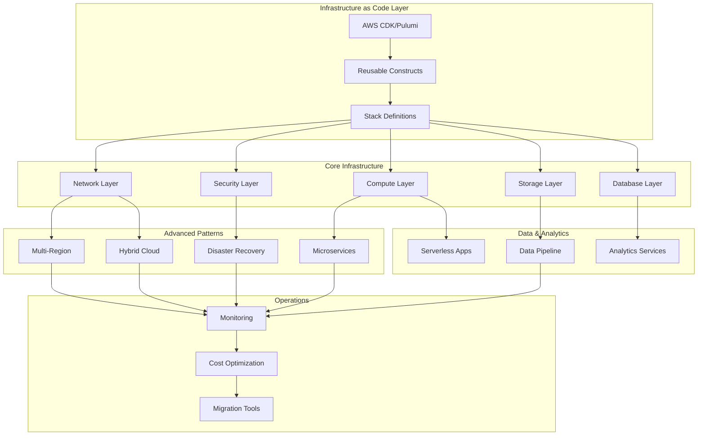
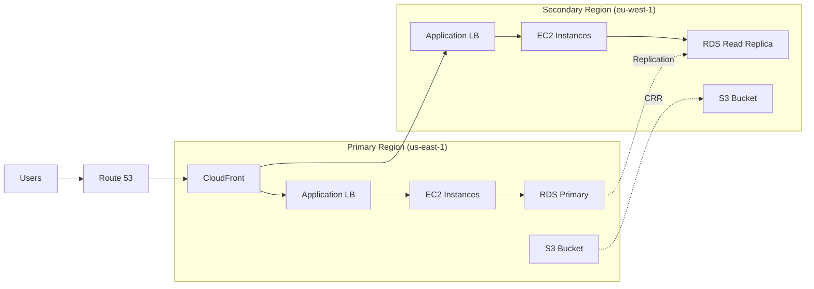
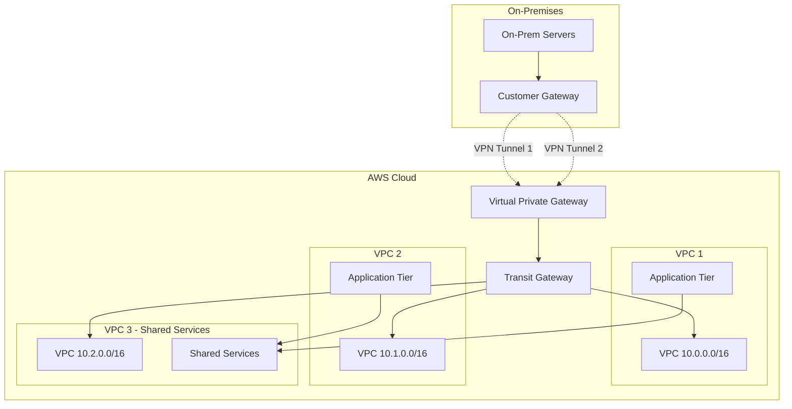
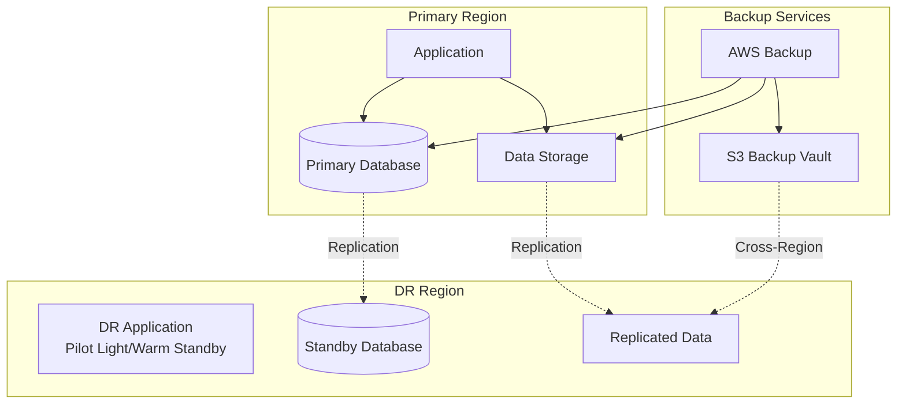

# Tài Liệu Thiết Kế: AWS SAP-C02 Practice Infrastructure

## Tổng Quan

Tài liệu này cung cấp hướng dẫn chi tiết về thiết kế và triển khai AWS SAP-C02 Practice Infrastructure - một nền tảng thực hành toàn diện cho việc chuẩn bị kỳ thi AWS Certified Solutions Architect - Professional. Hệ thống được xây dựng bằng Infrastructure as Code sử dụng AWS CDK với .NET hoặc Pulumi với C#, cho phép triển khai tự động các kiến trúc AWS phức tạp.

### Mục Tiêu Thiết Kế

- Tạo môi trường thực hành hands-on cho 12 chủ đề chính của SAP-C02
- Đảm bảo tính modular và khả năng tái sử dụng của code
- Tự động hóa hoàn toàn việc provisioning và cleanup
- Tối ưu hóa chi phí thông qua tagging và lifecycle management
- Cung cấp documentation chi tiết cho mỗi component

### Công Nghệ Sử Dụng

- **IaC Framework**: AWS CDK (.NET 6.0+) hoặc Pulumi (C#)
- **Language**: C# 10.0+
- **AWS Services**: 50+ services được tích hợp
- **Version Control**: Git
- **CI/CD**: GitHub Actions hoặc AWS CodePipeline

## Kiến Trúc Tổng Thể

### Sơ Đồ Kiến Trúc High-Level



### Cấu Trúc Thư Mục Dự Án

```
aws-sap-c02-practice/
├── src/
│   ├── Constructs/              # Reusable CDK constructs
│   │   ├── Network/
│   │   ├── Security/
│   │   ├── Compute/
│   │   ├── Storage/
│   │   └── Database/
│   ├── Stacks/                  # Stack definitions
│   │   ├── MultiRegionStack.cs
│   │   ├── HybridCloudStack.cs
│   │   ├── DisasterRecoveryStack.cs
│   │   ├── SecurityStack.cs
│   │   ├── HighAvailabilityStack.cs
│   │   ├── MicroservicesStack.cs
│   │   ├── DataAnalyticsStack.cs
│   │   ├── ServerlessStack.cs
│   │   ├── CostOptimizationStack.cs
│   │   ├── MigrationStack.cs
│   │   ├── MonitoringStack.cs
│   │   └── InfrastructureStack.cs
│   ├── Models/                  # Data models
│   ├── Utils/                   # Utility classes
│   └── Program.cs               # Entry point
├── tests/
│   ├── Unit/
│   └── Integration/
├── scripts/
│   ├── deploy.sh
│   ├── cleanup.sh
│   └── test-connectivity.sh
├── docs/
│   ├── architecture/
│   ├── deployment/
│   └── cost-estimates/
├── cdk.json                     # CDK configuration
└── README.md
```

## Thiết Kế Chi Tiết Từng Component


### Component 1: Multi-Region Architecture

#### Mô Tả

Component này triển khai kiến trúc multi-region với khả năng failover tự động, cross-region replication, và global content delivery. Đây là nền tảng cho việc hiểu cách thiết kế hệ thống có tính sẵn sàng cao toàn cầu.

#### Sơ Đồ Kiến Trúc



#### Hướng Dẫn Triển Khai

##### Bước 1: Tạo Base Construct cho Multi-Region

```csharp
// src/Constructs/Network/MultiRegionVpc.cs
using Amazon.CDK;
using Amazon.CDK.AWS.EC2;
using Constructs;

namespace AwsSapC02Practice.Constructs.Network
{
    public class MultiRegionVpcProps
    {
        public string Environment { get; set; }
        public string Region { get; set; }
        public string CidrBlock { get; set; }
        public int MaxAzs { get; set; } = 3;
    }

    public class MultiRegionVpc : Construct
    {
        public IVpc Vpc { get; }
        public ISecurityGroup ApplicationSecurityGroup { get; }
        public ISecurityGroup DatabaseSecurityGroup { get; }

        public MultiRegionVpc(Construct scope, string id, MultiRegionVpcProps props) 
            : base(scope, id)
        {
            // Tạo VPC với cấu hình multi-AZ
            Vpc = new Vpc(this, "Vpc", new VpcProps
            {
                IpAddresses = IpAddresses.Cidr(props.CidrBlock),
                MaxAzs = props.MaxAzs,
                NatGateways = 2, // High availability
                SubnetConfiguration = new[]
                {
                    new SubnetConfiguration
                    {
                        Name = "Public",
                        SubnetType = SubnetType.PUBLIC,
                        CidrMask = 24
                    },
                    new SubnetConfiguration
                    {
                        Name = "Private",
                        SubnetType = SubnetType.PRIVATE_WITH_EGRESS,
                        CidrMask = 24
                    },
                    new SubnetConfiguration
                    {
                        Name = "Isolated",
                        SubnetType = SubnetType.PRIVATE_ISOLATED,
                        CidrMask = 24
                    }
                }
            });

            // Tạo Security Groups
            ApplicationSecurityGroup = new SecurityGroup(this, "AppSG", new SecurityGroupProps
            {
                Vpc = Vpc,
                Description = "Security group for application tier",
                AllowAllOutbound = true
            });

            DatabaseSecurityGroup = new SecurityGroup(this, "DbSG", new SecurityGroupProps
            {
                Vpc = Vpc,
                Description = "Security group for database tier",
                AllowAllOutbound = false
            });

            // Cho phép traffic từ application tier đến database tier
            DatabaseSecurityGroup.AddIngressRule(
                ApplicationSecurityGroup,
                Port.Tcp(3306),
                "Allow MySQL from application tier"
            );

            // Tagging cho cost allocation
            Tags.Of(this).Add("Environment", props.Environment);
            Tags.Of(this).Add("Region", props.Region);
            Tags.Of(this).Add("Component", "MultiRegion");
            Tags.Of(this).Add("ManagedBy", "CDK");
        }
    }
}
```

##### Bước 2: Tạo S3 Cross-Region Replication

```csharp
// src/Constructs/Storage/CrossRegionS3.cs
using Amazon.CDK;
using Amazon.CDK.AWS.S3;
using Amazon.CDK.AWS.IAM;
using Constructs;

namespace AwsSapC02Practice.Constructs.Storage
{
    public class CrossRegionS3Props
    {
        public string PrimaryRegion { get; set; }
        public string SecondaryRegion { get; set; }
        public string BucketPrefix { get; set; }
    }

    public class CrossRegionS3 : Construct
    {
        public IBucket PrimaryBucket { get; }
        public IBucket SecondaryBucket { get; }

        public CrossRegionS3(Construct scope, string id, CrossRegionS3Props props) 
            : base(scope, id)
        {
            // Tạo IAM Role cho replication
            var replicationRole = new Role(this, "ReplicationRole", new RoleProps
            {
                AssumedBy = new ServicePrincipal("s3.amazonaws.com"),
                Description = "Role for S3 cross-region replication"
            });

            // Tạo Primary Bucket
            PrimaryBucket = new Bucket(this, "PrimaryBucket", new BucketProps
            {
                BucketName = $"{props.BucketPrefix}-primary-{props.PrimaryRegion}",
                Versioned = true, // Required for replication
                Encryption = BucketEncryption.S3_MANAGED,
                BlockPublicAccess = BlockPublicAccess.BLOCK_ALL,
                RemovalPolicy = RemovalPolicy.DESTROY,
                AutoDeleteObjects = true,
                LifecycleRules = new[]
                {
                    new LifecycleRule
                    {
                        Id = "TransitionToIA",
                        Enabled = true,
                        Transitions = new[]
                        {
                            new Transition
                            {
                                StorageClass = StorageClass.INFREQUENT_ACCESS,
                                TransitionAfter = Duration.Days(30)
                            },
                            new Transition
                            {
                                StorageClass = StorageClass.GLACIER,
                                TransitionAfter = Duration.Days(90)
                            }
                        }
                    }
                }
            });

            // Tạo Secondary Bucket (destination)
            SecondaryBucket = new Bucket(this, "SecondaryBucket", new BucketProps
            {
                BucketName = $"{props.BucketPrefix}-secondary-{props.SecondaryRegion}",
                Versioned = true,
                Encryption = BucketEncryption.S3_MANAGED,
                BlockPublicAccess = BlockPublicAccess.BLOCK_ALL,
                RemovalPolicy = RemovalPolicy.DESTROY,
                AutoDeleteObjects = true
            });

            // Grant permissions cho replication role
            PrimaryBucket.GrantRead(replicationRole);
            SecondaryBucket.GrantWrite(replicationRole);

            // Add replication configuration
            var cfnBucket = PrimaryBucket.Node.DefaultChild as CfnBucket;
            cfnBucket.ReplicationConfiguration = new CfnBucket.ReplicationConfigurationProperty
            {
                Role = replicationRole.RoleArn,
                Rules = new[]
                {
                    new CfnBucket.ReplicationRuleProperty
                    {
                        Status = "Enabled",
                        Priority = 1,
                        Filter = new CfnBucket.ReplicationRuleFilterProperty
                        {
                            Prefix = ""
                        },
                        Destination = new CfnBucket.ReplicationDestinationProperty
                        {
                            Bucket = SecondaryBucket.BucketArn,
                            ReplicationTime = new CfnBucket.ReplicationTimeProperty
                            {
                                Status = "Enabled",
                                Time = new CfnBucket.ReplicationTimeValueProperty
                                {
                                    Minutes = 15
                                }
                            },
                            Metrics = new CfnBucket.MetricsProperty
                            {
                                Status = "Enabled",
                                EventThreshold = new CfnBucket.ReplicationTimeValueProperty
                                {
                                    Minutes = 15
                                }
                            }
                        },
                        DeleteMarkerReplication = new CfnBucket.DeleteMarkerReplicationProperty
                        {
                            Status = "Enabled"
                        }
                    }
                }
            };

            // Tagging
            Tags.Of(this).Add("Component", "CrossRegionReplication");
        }
    }
}
```

##### Bước 3: Tạo RDS với Cross-Region Read Replica

```csharp
// src/Constructs/Database/MultiRegionRds.cs
using Amazon.CDK;
using Amazon.CDK.AWS.RDS;
using Amazon.CDK.AWS.EC2;
using Constructs;

namespace AwsSapC02Practice.Constructs.Database
{
    public class MultiRegionRdsProps
    {
        public IVpc Vpc { get; set; }
        public ISecurityGroup SecurityGroup { get; set; }
        public string DatabaseName { get; set; }
        public string MasterUsername { get; set; }
        public bool CreateReadReplica { get; set; } = true;
    }

    public class MultiRegionRds : Construct
    {
        public IDatabaseInstance PrimaryInstance { get; }
        public string PrimaryEndpoint { get; }

        public MultiRegionRds(Construct scope, string id, MultiRegionRdsProps props) 
            : base(scope, id)
        {
            // Tạo subnet group cho RDS
            var subnetGroup = new SubnetGroup(this, "SubnetGroup", new SubnetGroupProps
            {
                Description = "Subnet group for RDS",
                Vpc = props.Vpc,
                VpcSubnets = new SubnetSelection
                {
                    SubnetType = SubnetType.PRIVATE_ISOLATED
                },
                RemovalPolicy = RemovalPolicy.DESTROY
            });

            // Tạo parameter group
            var parameterGroup = new ParameterGroup(this, "ParameterGroup", new ParameterGroupProps
            {
                Engine = DatabaseInstanceEngine.Mysql(new MySqlInstanceEngineProps
                {
                    Version = MysqlEngineVersion.VER_8_0_35
                }),
                Description = "Custom parameter group for multi-region RDS",
                Parameters = new Dictionary<string, string>
                {
                    { "max_connections", "200" },
                    { "slow_query_log", "1" },
                    { "long_query_time", "2" }
                }
            });

            // Tạo RDS Primary Instance với Multi-AZ
            PrimaryInstance = new DatabaseInstance(this, "PrimaryInstance", new DatabaseInstanceProps
            {
                Engine = DatabaseInstanceEngine.Mysql(new MySqlInstanceEngineProps
                {
                    Version = MysqlEngineVersion.VER_8_0_35
                }),
                InstanceType = InstanceType.Of(InstanceClass.BURSTABLE3, InstanceSize.MEDIUM),
                Vpc = props.Vpc,
                VpcSubnets = new SubnetSelection
                {
                    SubnetType = SubnetType.PRIVATE_ISOLATED
                },
                SecurityGroups = new[] { props.SecurityGroup },
                SubnetGroup = subnetGroup,
                ParameterGroup = parameterGroup,
                DatabaseName = props.DatabaseName,
                Credentials = Credentials.FromGeneratedSecret(props.MasterUsername),
                MultiAz = true, // Enable Multi-AZ for high availability
                AllocatedStorage = 100,
                MaxAllocatedStorage = 200, // Enable storage autoscaling
                StorageType = StorageType.GP3,
                StorageEncrypted = true,
                BackupRetention = Duration.Days(7),
                PreferredBackupWindow = "03:00-04:00",
                PreferredMaintenanceWindow = "sun:04:00-sun:05:00",
                DeletionProtection = false, // Set to true in production
                RemovalPolicy = RemovalPolicy.DESTROY,
                CloudwatchLogsExports = new[] { "error", "general", "slowquery" },
                EnablePerformanceInsights = true,
                PerformanceInsightRetention = PerformanceInsightRetention.DEFAULT,
                MonitoringInterval = Duration.Seconds(60)
            });

            PrimaryEndpoint = PrimaryInstance.DbInstanceEndpointAddress;

            // Output cho connection string
            new CfnOutput(this, "PrimaryDbEndpoint", new CfnOutputProps
            {
                Value = PrimaryEndpoint,
                Description = "Primary RDS endpoint",
                ExportName = "PrimaryDbEndpoint"
            });

            new CfnOutput(this, "PrimaryDbSecretArn", new CfnOutputProps
            {
                Value = PrimaryInstance.Secret.SecretArn,
                Description = "ARN of the secret containing database credentials",
                ExportName = "PrimaryDbSecretArn"
            });

            // Tagging
            Tags.Of(this).Add("Component", "MultiRegionDatabase");
            Tags.Of(this).Add("DatabaseType", "Primary");
        }
    }
}
```

##### Bước 4: Tạo Route 53 với Health Checks và Failover

```csharp
// src/Constructs/Network/GlobalRouting.cs
using Amazon.CDK;
using Amazon.CDK.AWS.Route53;
using Amazon.CDK.AWS.Route53.Targets;
using Amazon.CDK.AWS.ElasticLoadBalancingV2;
using Amazon.CDK.AWS.CloudWatch;
using Constructs;

namespace AwsSapC02Practice.Constructs.Network
{
    public class GlobalRoutingProps
    {
        public string DomainName { get; set; }
        public IApplicationLoadBalancer PrimaryLoadBalancer { get; set; }
        public IApplicationLoadBalancer SecondaryLoadBalancer { get; set; }
        public string PrimaryRegion { get; set; }
        public string SecondaryRegion { get; set; }
    }

    public class GlobalRouting : Construct
    {
        public IHostedZone HostedZone { get; }

        public GlobalRouting(Construct scope, string id, GlobalRoutingProps props) 
            : base(scope, id)
        {
            // Tạo hoặc import hosted zone
            HostedZone = new PublicHostedZone(this, "HostedZone", new PublicHostedZoneProps
            {
                ZoneName = props.DomainName,
                Comment = "Hosted zone for multi-region application"
            });

            // Tạo health check cho primary region
            var primaryHealthCheck = new CfnHealthCheck(this, "PrimaryHealthCheck", new CfnHealthCheckProps
            {
                HealthCheckConfig = new CfnHealthCheck.HealthCheckConfigProperty
                {
                    Type = "HTTPS",
                    ResourcePath = "/health",
                    FullyQualifiedDomainName = props.PrimaryLoadBalancer.LoadBalancerDnsName,
                    Port = 443,
                    RequestInterval = 30,
                    FailureThreshold = 3,
                    MeasureLatency = true
                },
                HealthCheckTags = new[]
                {
                    new CfnHealthCheck.HealthCheckTagProperty
                    {
                        Key = "Name",
                        Value = "Primary-Region-Health-Check"
                    }
                }
            });

            // Tạo health check cho secondary region
            var secondaryHealthCheck = new CfnHealthCheck(this, "SecondaryHealthCheck", new CfnHealthCheckProps
            {
                HealthCheckConfig = new CfnHealthCheck.HealthCheckConfigProperty
                {
                    Type = "HTTPS",
                    ResourcePath = "/health",
                    FullyQualifiedDomainName = props.SecondaryLoadBalancer.LoadBalancerDnsName,
                    Port = 443,
                    RequestInterval = 30,
                    FailureThreshold = 3,
                    MeasureLatency = true
                }
            });

            // Tạo primary record với failover
            new ARecord(this, "PrimaryRecord", new ARecordProps
            {
                Zone = HostedZone,
                RecordName = "app",
                Target = RecordTarget.FromAlias(new LoadBalancerTarget(props.PrimaryLoadBalancer)),
                Comment = "Primary region endpoint",
                // Failover configuration
                SetIdentifier = $"Primary-{props.PrimaryRegion}",
                // Note: CDK L2 constructs don't fully support failover yet
                // You may need to use L1 constructs for complete failover setup
            });

            // Tạo secondary record với failover
            new ARecord(this, "SecondaryRecord", new ARecordProps
            {
                Zone = HostedZone,
                RecordName = "app",
                Target = RecordTarget.FromAlias(new LoadBalancerTarget(props.SecondaryLoadBalancer)),
                Comment = "Secondary region endpoint",
                SetIdentifier = $"Secondary-{props.SecondaryRegion}"
            });

            // Tạo CloudWatch alarms cho health checks
            var primaryAlarm = new CfnAlarm(this, "PrimaryHealthAlarm", new CfnAlarmProps
            {
                AlarmName = "Primary-Region-Health-Alarm",
                AlarmDescription = "Alert when primary region health check fails",
                MetricName = "HealthCheckStatus",
                Namespace = "AWS/Route53",
                Statistic = "Minimum",
                Period = 60,
                EvaluationPeriods = 2,
                Threshold = 1,
                ComparisonOperator = "LessThanThreshold",
                Dimensions = new[]
                {
                    new CfnAlarm.DimensionProperty
                    {
                        Name = "HealthCheckId",
                        Value = primaryHealthCheck.AttrHealthCheckId
                    }
                }
            });

            // Output
            new CfnOutput(this, "HostedZoneId", new CfnOutputProps
            {
                Value = HostedZone.HostedZoneId,
                Description = "Hosted Zone ID",
                ExportName = "HostedZoneId"
            });

            new CfnOutput(this, "DomainName", new CfnOutputProps
            {
                Value = $"app.{props.DomainName}",
                Description = "Application domain name",
                ExportName = "AppDomainName"
            });
        }
    }
}
```

##### Bước 5: Tạo CloudFront Distribution

```csharp
// src/Constructs/Network/GlobalCdn.cs
using Amazon.CDK;
using Amazon.CDK.AWS.CloudFront;
using Amazon.CDK.AWS.CloudFront.Origins;
using Amazon.CDK.AWS.S3;
using Amazon.CDK.AWS.CertificateManager;
using Amazon.CDK.AWS.ElasticLoadBalancingV2;
using Constructs;

namespace AwsSapC02Practice.Constructs.Network
{
    public class GlobalCdnProps
    {
        public IApplicationLoadBalancer PrimaryOrigin { get; set; }
        public IApplicationLoadBalancer SecondaryOrigin { get; set; }
        public IBucket LogBucket { get; set; }
        public string DomainName { get; set; }
        public ICertificate Certificate { get; set; }
    }

    public class GlobalCdn : Construct
    {
        public IDistribution Distribution { get; }

        public GlobalCdn(Construct scope, string id, GlobalCdnProps props) 
            : base(scope, id)
        {
            // Tạo origin group với failover
            var primaryOrigin = new HttpOrigin(props.PrimaryOrigin.LoadBalancerDnsName, new HttpOriginProps
            {
                ProtocolPolicy = OriginProtocolPolicy.HTTPS_ONLY,
                HttpPort = 80,
                HttpsPort = 443,
                OriginSslProtocols = new[] { OriginSslPolicy.TLS_V1_2 },
                ConnectionAttempts = 3,
                ConnectionTimeout = Duration.Seconds(10),
                CustomHeaders = new Dictionary<string, string>
                {
                    { "X-Custom-Header", "CloudFront" }
                }
            });

            var secondaryOrigin = new HttpOrigin(props.SecondaryOrigin.LoadBalancerDnsName, new HttpOriginProps
            {
                ProtocolPolicy = OriginProtocolPolicy.HTTPS_ONLY,
                HttpPort = 80,
                HttpsPort = 443,
                OriginSslProtocols = new[] { OriginSslPolicy.TLS_V1_2 },
                ConnectionAttempts = 3,
                ConnectionTimeout = Duration.Seconds(10)
            });

            // Tạo cache policy
            var cachePolicy = new CachePolicy(this, "CachePolicy", new CachePolicyProps
            {
                CachePolicyName = "MultiRegionCachePolicy",
                Comment = "Cache policy for multi-region application",
                DefaultTtl = Duration.Hours(24),
                MinTtl = Duration.Seconds(0),
                MaxTtl = Duration.Days(365),
                CookieBehavior = CacheCookieBehavior.None(),
                HeaderBehavior = CacheHeaderBehavior.AllowList("CloudFront-Viewer-Country"),
                QueryStringBehavior = CacheQueryStringBehavior.All(),
                EnableAcceptEncodingGzip = true,
                EnableAcceptEncodingBrotli = true
            });

            // Tạo origin request policy
            var originRequestPolicy = new OriginRequestPolicy(this, "OriginRequestPolicy", new OriginRequestPolicyProps
            {
                OriginRequestPolicyName = "MultiRegionOriginRequestPolicy",
                Comment = "Origin request policy for multi-region application",
                CookieBehavior = OriginRequestCookieBehavior.All(),
                HeaderBehavior = OriginRequestHeaderBehavior.AllowList(
                    "Accept",
                    "Accept-Language",
                    "Authorization"
                ),
                QueryStringBehavior = OriginRequestQueryStringBehavior.All()
            });

            // Tạo response headers policy
            var responseHeadersPolicy = new ResponseHeadersPolicy(this, "ResponseHeadersPolicy", new ResponseHeadersPolicyProps
            {
                ResponseHeadersPolicyName = "SecurityHeadersPolicy",
                Comment = "Security headers for multi-region application",
                SecurityHeadersBehavior = new ResponseSecurityHeadersBehavior
                {
                    StrictTransportSecurity = new ResponseHeadersStrictTransportSecurity
                    {
                        AccessControlMaxAge = Duration.Days(365),
                        IncludeSubdomains = true,
                        Override = true
                    },
                    ContentTypeOptions = new ResponseHeadersContentTypeOptions
                    {
                        Override = true
                    },
                    FrameOptions = new ResponseHeadersFrameOptions
                    {
                        FrameOption = HeadersFrameOption.DENY,
                        Override = true
                    },
                    XssProtection = new ResponseHeadersXSSProtection
                    {
                        Protection = true,
                        ModeBlock = true,
                        Override = true
                    },
                    ReferrerPolicy = new ResponseHeadersReferrerPolicy
                    {
                        ReferrerPolicy = HeadersReferrerPolicy.STRICT_ORIGIN_WHEN_CROSS_ORIGIN,
                        Override = true
                    }
                }
            });

            // Tạo CloudFront distribution
            Distribution = new Distribution(this, "Distribution", new DistributionProps
            {
                Comment = "Multi-region CloudFront distribution",
                DefaultBehavior = new BehaviorOptions
                {
                    Origin = primaryOrigin,
                    ViewerProtocolPolicy = ViewerProtocolPolicy.REDIRECT_TO_HTTPS,
                    AllowedMethods = AllowedMethods.ALLOW_ALL,
                    CachedMethods = CachedMethods.CACHE_GET_HEAD_OPTIONS,
                    CachePolicy = cachePolicy,
                    OriginRequestPolicy = originRequestPolicy,
                    ResponseHeadersPolicy = responseHeadersPolicy,
                    Compress = true
                },
                AdditionalBehaviors = new Dictionary<string, IBehaviorOptions>
                {
                    {
                        "/api/*", new BehaviorOptions
                        {
                            Origin = primaryOrigin,
                            ViewerProtocolPolicy = ViewerProtocolPolicy.HTTPS_ONLY,
                            AllowedMethods = AllowedMethods.ALLOW_ALL,
                            CachePolicy = CachePolicy.CACHING_DISABLED,
                            OriginRequestPolicy = OriginRequestPolicy.ALL_VIEWER
                        }
                    }
                },
                EnableLogging = true,
                LogBucket = props.LogBucket,
                LogFilePrefix = "cloudfront-logs/",
                LogIncludesCookies = true,
                PriceClass = PriceClass.PRICE_CLASS_ALL,
                GeoRestriction = GeoRestriction.Allowlist("US", "CA", "GB", "DE", "FR", "VN"),
                HttpVersion = HttpVersion.HTTP2_AND_3,
                MinimumProtocolVersion = SecurityPolicyProtocol.TLS_V1_2_2021,
                EnableIpv6 = true,
                DomainNames = new[] { props.DomainName },
                Certificate = props.Certificate
            });

            // Output
            new CfnOutput(this, "DistributionId", new CfnOutputProps
            {
                Value = Distribution.DistributionId,
                Description = "CloudFront Distribution ID",
                ExportName = "CloudFrontDistributionId"
            });

            new CfnOutput(this, "DistributionDomainName", new CfnOutputProps
            {
                Value = Distribution.DistributionDomainName,
                Description = "CloudFront Distribution Domain Name",
                ExportName = "CloudFrontDomainName"
            });

            // Tagging
            Tags.Of(this).Add("Component", "GlobalCDN");
        }
    }
}
```


##### Bước 6: Tạo Multi-Region Stack

```csharp
// src/Stacks/MultiRegionStack.cs
using Amazon.CDK;
using AwsSapC02Practice.Constructs.Network;
using AwsSapC02Practice.Constructs.Storage;
using AwsSapC02Practice.Constructs.Database;
using Constructs;

namespace AwsSapC02Practice.Stacks
{
    public class MultiRegionStackProps : StackProps
    {
        public string Environment { get; set; }
        public bool IsPrimaryRegion { get; set; }
        public string PrimaryRegion { get; set; }
        public string SecondaryRegion { get; set; }
    }

    public class MultiRegionStack : Stack
    {
        public MultiRegionStack(Construct scope, string id, MultiRegionStackProps props) 
            : base(scope, id, props)
        {
            // Xác định CIDR block dựa trên region
            var cidrBlock = props.IsPrimaryRegion ? "10.0.0.0/16" : "10.1.0.0/16";

            // Tạo VPC
            var vpc = new MultiRegionVpc(this, "Vpc", new MultiRegionVpcProps
            {
                Environment = props.Environment,
                Region = props.Env.Region,
                CidrBlock = cidrBlock,
                MaxAzs = 3
            });

            // Tạo S3 buckets với cross-region replication (chỉ trong primary region)
            if (props.IsPrimaryRegion)
            {
                var s3Replication = new CrossRegionS3(this, "S3Replication", new CrossRegionS3Props
                {
                    PrimaryRegion = props.PrimaryRegion,
                    SecondaryRegion = props.SecondaryRegion,
                    BucketPrefix = $"sap-c02-practice-{props.Environment}"
                });
            }

            // Tạo RDS instance
            var database = new MultiRegionRds(this, "Database", new MultiRegionRdsProps
            {
                Vpc = vpc.Vpc,
                SecurityGroup = vpc.DatabaseSecurityGroup,
                DatabaseName = "sapc02db",
                MasterUsername = "admin",
                CreateReadReplica = !props.IsPrimaryRegion
            });

            // Tạo Application Load Balancer
            var alb = new ApplicationLoadBalancer(this, "ALB", new ApplicationLoadBalancerProps
            {
                Vpc = vpc.Vpc,
                InternetFacing = true,
                LoadBalancerName = $"sap-c02-alb-{props.Env.Region}",
                VpcSubnets = new SubnetSelection
                {
                    SubnetType = SubnetType.PUBLIC
                },
                SecurityGroup = vpc.ApplicationSecurityGroup
            });

            // Tạo target group
            var targetGroup = new ApplicationTargetGroup(this, "TargetGroup", new ApplicationTargetGroupProps
            {
                Vpc = vpc.Vpc,
                Port = 80,
                Protocol = ApplicationProtocol.HTTP,
                TargetType = TargetType.INSTANCE,
                HealthCheck = new Amazon.CDK.AWS.ElasticLoadBalancingV2.HealthCheck
                {
                    Path = "/health",
                    Interval = Duration.Seconds(30),
                    Timeout = Duration.Seconds(5),
                    HealthyThresholdCount = 2,
                    UnhealthyThresholdCount = 3
                },
                DeregistrationDelay = Duration.Seconds(30)
            });

            // Add listener
            alb.AddListener("HttpListener", new ApplicationListenerProps
            {
                Port = 80,
                Protocol = ApplicationProtocol.HTTP,
                DefaultTargetGroups = new[] { targetGroup }
            });

            // Outputs
            new CfnOutput(this, "VpcId", new CfnOutputProps
            {
                Value = vpc.Vpc.VpcId,
                Description = "VPC ID",
                ExportName = $"{props.Env.Region}-VpcId"
            });

            new CfnOutput(this, "LoadBalancerDns", new CfnOutputProps
            {
                Value = alb.LoadBalancerDnsName,
                Description = "Load Balancer DNS Name",
                ExportName = $"{props.Env.Region}-AlbDns"
            });

            // Tagging
            Tags.Of(this).Add("Stack", "MultiRegion");
            Tags.Of(this).Add("Environment", props.Environment);
            Tags.Of(this).Add("Region", props.Env.Region);
            Tags.Of(this).Add("IsPrimary", props.IsPrimaryRegion.ToString());
        }
    }
}
```

#### Data Models

```csharp
// src/Models/MultiRegionConfig.cs
namespace AwsSapC02Practice.Models
{
    public class MultiRegionConfig
    {
        public string PrimaryRegion { get; set; } = "us-east-1";
        public string SecondaryRegion { get; set; } = "eu-west-1";
        public string Environment { get; set; } = "dev";
        public bool EnableCrossRegionReplication { get; set; } = true;
        public bool EnableGlobalAccelerator { get; set; } = false;
        public int HealthCheckIntervalSeconds { get; set; } = 30;
        public int FailoverThreshold { get; set; } = 3;
    }

    public class RegionEndpoint
    {
        public string Region { get; set; }
        public string LoadBalancerDns { get; set; }
        public string DatabaseEndpoint { get; set; }
        public bool IsPrimary { get; set; }
        public string HealthStatus { get; set; }
    }
}
```

#### Testing Strategy

```csharp
// tests/Unit/MultiRegionTests.cs
using Xunit;
using Amazon.CDK;
using Amazon.CDK.Assertions;
using AwsSapC02Practice.Stacks;

namespace AwsSapC02Practice.Tests.Unit
{
    public class MultiRegionStackTests
    {
        [Fact]
        public void TestVpcCreation()
        {
            // Arrange
            var app = new App();
            var stack = new MultiRegionStack(app, "TestStack", new MultiRegionStackProps
            {
                Environment = "test",
                IsPrimaryRegion = true,
                PrimaryRegion = "us-east-1",
                SecondaryRegion = "eu-west-1",
                Env = new Amazon.CDK.Environment
                {
                    Region = "us-east-1",
                    Account = "123456789012"
                }
            });

            // Act
            var template = Template.FromStack(stack);

            // Assert
            template.ResourceCountIs("AWS::EC2::VPC", 1);
            template.HasResourceProperties("AWS::EC2::VPC", new Dictionary<string, object>
            {
                { "CidrBlock", "10.0.0.0/16" },
                { "EnableDnsHostnames", true },
                { "EnableDnsSupport", true }
            });
        }

        [Fact]
        public void TestMultiAzDeployment()
        {
            // Arrange
            var app = new App();
            var stack = new MultiRegionStack(app, "TestStack", new MultiRegionStackProps
            {
                Environment = "test",
                IsPrimaryRegion = true,
                PrimaryRegion = "us-east-1",
                SecondaryRegion = "eu-west-1",
                Env = new Amazon.CDK.Environment { Region = "us-east-1" }
            });

            // Act
            var template = Template.FromStack(stack);

            // Assert - Verify subnets across multiple AZs
            template.ResourceCountIs("AWS::EC2::Subnet", 9); // 3 AZs * 3 subnet types
        }

        [Fact]
        public void TestRdsMultiAzEnabled()
        {
            // Arrange
            var app = new App();
            var stack = new MultiRegionStack(app, "TestStack", new MultiRegionStackProps
            {
                Environment = "test",
                IsPrimaryRegion = true,
                PrimaryRegion = "us-east-1",
                SecondaryRegion = "eu-west-1",
                Env = new Amazon.CDK.Environment { Region = "us-east-1" }
            });

            // Act
            var template = Template.FromStack(stack);

            // Assert
            template.HasResourceProperties("AWS::RDS::DBInstance", new Dictionary<string, object>
            {
                { "MultiAZ", true },
                { "StorageEncrypted", true }
            });
        }
    }
}
```

#### Deployment Instructions

1. **Cài đặt dependencies**:
```bash
dotnet add package Amazon.CDK.Lib
dotnet add package Amazon.CDK.AWS.EC2
dotnet add package Amazon.CDK.AWS.RDS
dotnet add package Amazon.CDK.AWS.S3
dotnet add package Amazon.CDK.AWS.Route53
dotnet add package Amazon.CDK.AWS.CloudFront
```

2. **Deploy vào primary region**:
```bash
cdk deploy MultiRegionStack-Primary \
  --context environment=dev \
  --context isPrimary=true \
  --context primaryRegion=us-east-1 \
  --context secondaryRegion=eu-west-1 \
  --region us-east-1
```

3. **Deploy vào secondary region**:
```bash
cdk deploy MultiRegionStack-Secondary \
  --context environment=dev \
  --context isPrimary=false \
  --context primaryRegion=us-east-1 \
  --context secondaryRegion=eu-west-1 \
  --region eu-west-1
```

4. **Verify deployment**:
```bash
# Test primary endpoint
curl https://app.yourdomain.com/health

# Test secondary endpoint
curl https://app-secondary.yourdomain.com/health

# Check S3 replication status
aws s3api get-bucket-replication --bucket sap-c02-practice-dev-primary-us-east-1
```

#### Cost Estimation

- **VPC**: Free (data transfer charges apply)
- **NAT Gateways**: ~$32/month per NAT Gateway × 2 = $64/month
- **RDS Multi-AZ db.t3.medium**: ~$120/month
- **S3 Storage**: ~$0.023/GB + replication costs
- **CloudFront**: Pay per use (~$0.085/GB for first 10TB)
- **Route 53**: $0.50/hosted zone + $0.40/million queries
- **Application Load Balancer**: ~$22/month + LCU charges

**Total Estimated Cost**: ~$250-350/month (depending on usage)

---

### Component 2: Hybrid Cloud Connectivity

#### Mô Tả

Component này triển khai các giải pháp kết nối hybrid cloud, bao gồm Site-to-Site VPN, Transit Gateway, và mô phỏng Direct Connect. Đây là nền tảng để hiểu cách tích hợp on-premises infrastructure với AWS cloud.

#### Sơ Đồ Kiến Trúc



#### Hướng Dẫn Triển Khai

##### Bước 1: Tạo Customer Gateway

```csharp
// src/Constructs/Network/HybridConnectivity.cs
using Amazon.CDK;
using Amazon.CDK.AWS.EC2;
using Constructs;

namespace AwsSapC02Practice.Constructs.Network
{
    public class HybridConnectivityProps
    {
        public IVpc Vpc { get; set; }
        public string CustomerGatewayIp { get; set; }
        public int BgpAsn { get; set; } = 65000;
        public string OnPremisesCidr { get; set; }
    }

    public class HybridConnectivity : Construct
    {
        public CfnCustomerGateway CustomerGateway { get; }
        public CfnVPNGateway VpnGateway { get; }
        public CfnVPNConnection VpnConnection { get; }

        public HybridConnectivity(Construct scope, string id, HybridConnectivityProps props) 
            : base(scope, id)
        {
            // Tạo Customer Gateway (đại diện cho on-premises router)
            CustomerGateway = new CfnCustomerGateway(this, "CustomerGateway", new CfnCustomerGatewayProps
            {
                BgpAsn = props.BgpAsn,
                IpAddress = props.CustomerGatewayIp,
                Type = "ipsec.1",
                Tags = new[]
                {
                    new CfnTag
                    {
                        Key = "Name",
                        Value = "OnPremises-CGW"
                    }
                }
            });

            // Tạo Virtual Private Gateway
            VpnGateway = new CfnVPNGateway(this, "VpnGateway", new CfnVPNGatewayProps
            {
                Type = "ipsec.1",
                AmazonSideAsn = 64512,
                Tags = new[]
                {
                    new CfnTag
                    {
                        Key = "Name",
                        Value = "AWS-VGW"
                    }
                }
            });

            // Attach VPN Gateway to VPC
            var vpcGatewayAttachment = new CfnVPCGatewayAttachment(this, "VpcGatewayAttachment", 
                new CfnVPCGatewayAttachmentProps
            {
                VpcId = props.Vpc.VpcId,
                VpnGatewayId = VpnGateway.Ref
            });

            // Tạo VPN Connection với redundant tunnels
            VpnConnection = new CfnVPNConnection(this, "VpnConnection", new CfnVPNConnectionProps
            {
                Type = "ipsec.1",
                CustomerGatewayId = CustomerGateway.Ref,
                VpnGatewayId = VpnGateway.Ref,
                StaticRoutesOnly = false, // Enable BGP
                Tags = new[]
                {
                    new CfnTag
                    {
                        Key = "Name",
                        Value = "Hybrid-VPN-Connection"
                    }
                },
                VpnTunnelOptionsSpecifications = new[]
                {
                    // Tunnel 1
                    new CfnVPNConnection.VpnTunnelOptionsSpecificationProperty
                    {
                        PreSharedKey = "MyPreSharedKey123!", // In production, use Secrets Manager
                        TunnelInsideCidr = "169.254.10.0/30"
                    },
                    // Tunnel 2 (redundant)
                    new CfnVPNConnection.VpnTunnelOptionsSpecificationProperty
                    {
                        PreSharedKey = "MyPreSharedKey456!", // In production, use Secrets Manager
                        TunnelInsideCidr = "169.254.10.4/30"
                    }
                }
            });

            // Enable route propagation
            foreach (var subnet in props.Vpc.PrivateSubnets)
            {
                var routeTable = subnet.RouteTable;
                new CfnVPNGatewayRoutePropagation(this, $"RoutePropagation-{subnet.Node.Id}", 
                    new CfnVPNGatewayRoutePropagationProps
                {
                    RouteTableIds = new[] { routeTable.RouteTableId },
                    VpnGatewayId = VpnGateway.Ref
                });
            }

            // Outputs
            new CfnOutput(this, "VpnConnectionId", new CfnOutputProps
            {
                Value = VpnConnection.Ref,
                Description = "VPN Connection ID",
                ExportName = "VpnConnectionId"
            });

            new CfnOutput(this, "CustomerGatewayId", new CfnOutputProps
            {
                Value = CustomerGateway.Ref,
                Description = "Customer Gateway ID",
                ExportName = "CustomerGatewayId"
            });

            // Tagging
            Tags.Of(this).Add("Component", "HybridConnectivity");
        }
    }
}
```

##### Bước 2: Tạo Transit Gateway

```csharp
// src/Constructs/Network/TransitGatewayHub.cs
using Amazon.CDK;
using Amazon.CDK.AWS.EC2;
using Constructs;
using System.Collections.Generic;

namespace AwsSapC02Practice.Constructs.Network
{
    public class TransitGatewayHubProps
    {
        public List<IVpc> Vpcs { get; set; }
        public string Description { get; set; }
        public int AmazonSideAsn { get; set; } = 64512;
    }

    public class TransitGatewayHub : Construct
    {
        public CfnTransitGateway TransitGateway { get; }
        public Dictionary<string, CfnTransitGatewayAttachment> Attachments { get; }

        public TransitGatewayHub(Construct scope, string id, TransitGatewayHubProps props) 
            : base(scope, id)
        {
            Attachments = new Dictionary<string, CfnTransitGatewayAttachment>();

            // Tạo Transit Gateway
            TransitGateway = new CfnTransitGateway(this, "TransitGateway", new CfnTransitGatewayProps
            {
                Description = props.Description ?? "Transit Gateway for hybrid connectivity",
                AmazonSideAsn = props.AmazonSideAsn,
                DefaultRouteTableAssociation = "enable",
                DefaultRouteTablePropagation = "enable",
                DnsSupport = "enable",
                VpnEcmpSupport = "enable", // Enable ECMP for VPN
                AutoAcceptSharedAttachments = "enable",
                Tags = new[]
                {
                    new CfnTag
                    {
                        Key = "Name",
                        Value = "Central-Transit-Gateway"
                    }
                }
            });

            // Attach tất cả VPCs vào Transit Gateway
            for (int i = 0; i < props.Vpcs.Count; i++)
            {
                var vpc = props.Vpcs[i];
                var vpcName = $"VPC-{i + 1}";

                // Lấy subnet IDs cho attachment
                var subnetIds = new List<string>();
                foreach (var subnet in vpc.PrivateSubnets)
                {
                    subnetIds.Add(subnet.SubnetId);
                }

                // Tạo Transit Gateway Attachment
                var attachment = new CfnTransitGatewayAttachment(this, $"TgwAttachment-{vpcName}", 
                    new CfnTransitGatewayAttachmentProps
                {
                    TransitGatewayId = TransitGateway.Ref,
                    VpcId = vpc.VpcId,
                    SubnetIds = subnetIds.ToArray(),
                    Tags = new[]
                    {
                        new CfnTag
                        {
                            Key = "Name",
                            Value = $"TGW-Attachment-{vpcName}"
                        }
                    }
                });

                Attachments[vpcName] = attachment;

                // Thêm routes trong VPC route tables để point đến Transit Gateway
                foreach (var subnet in vpc.PrivateSubnets)
                {
                    new CfnRoute(this, $"TgwRoute-{vpcName}-{subnet.Node.Id}", new CfnRouteProps
                    {
                        RouteTableId = subnet.RouteTable.RouteTableId,
                        DestinationCidrBlock = "10.0.0.0/8", // Route all private traffic through TGW
                        TransitGatewayId = TransitGateway.Ref
                    }).Node.AddDependency(attachment);
                }
            }

            // Tạo Transit Gateway Route Table
            var routeTable = new CfnTransitGatewayRouteTable(this, "TgwRouteTable", 
                new CfnTransitGatewayRouteTableProps
            {
                TransitGatewayId = TransitGateway.Ref,
                Tags = new[]
                {
                    new CfnTag
                    {
                        Key = "Name",
                        Value = "TGW-Main-Route-Table"
                    }
                }
            });

            // Outputs
            new CfnOutput(this, "TransitGatewayId", new CfnOutputProps
            {
                Value = TransitGateway.Ref,
                Description = "Transit Gateway ID",
                ExportName = "TransitGatewayId"
            });

            new CfnOutput(this, "TransitGatewayRouteTableId", new CfnOutputProps
            {
                Value = routeTable.Ref,
                Description = "Transit Gateway Route Table ID",
                ExportName = "TgwRouteTableId"
            });

            // Tagging
            Tags.Of(this).Add("Component", "TransitGateway");
        }
    }
}
```


##### Bước 3: Tạo Hybrid Cloud Stack

```csharp
// src/Stacks/HybridCloudStack.cs
using Amazon.CDK;
using AwsSapC02Practice.Constructs.Network;
using Constructs;
using System.Collections.Generic;

namespace AwsSapC02Practice.Stacks
{
    public class HybridCloudStack : Stack
    {
        public HybridCloudStack(Construct scope, string id, IStackProps props = null) 
            : base(scope, id, props)
        {
            // Tạo multiple VPCs
            var vpc1 = new Vpc(this, "Vpc1", new VpcProps
            {
                IpAddresses = IpAddresses.Cidr("10.0.0.0/16"),
                MaxAzs = 2,
                SubnetConfiguration = new[]
                {
                    new SubnetConfiguration
                    {
                        Name = "Private",
                        SubnetType = SubnetType.PRIVATE_WITH_EGRESS,
                        CidrMask = 24
                    }
                }
            });

            var vpc2 = new Vpc(this, "Vpc2", new VpcProps
            {
                IpAddresses = IpAddresses.Cidr("10.1.0.0/16"),
                MaxAzs = 2,
                SubnetConfiguration = new[]
                {
                    new SubnetConfiguration
                    {
                        Name = "Private",
                        SubnetType = SubnetType.PRIVATE_WITH_EGRESS,
                        CidrMask = 24
                    }
                }
            });

            var vpc3 = new Vpc(this, "Vpc3-SharedServices", new VpcProps
            {
                IpAddresses = IpAddresses.Cidr("10.2.0.0/16"),
                MaxAzs = 2,
                SubnetConfiguration = new[]
                {
                    new SubnetConfiguration
                    {
                        Name = "Private",
                        SubnetType = SubnetType.PRIVATE_WITH_EGRESS,
                        CidrMask = 24
                    }
                }
            });

            // Tạo Transit Gateway và attach VPCs
            var transitGateway = new TransitGatewayHub(this, "TransitGateway", new TransitGatewayHubProps
            {
                Vpcs = new List<IVpc> { vpc1, vpc2, vpc3 },
                Description = "Central Transit Gateway for hybrid connectivity",
                AmazonSideAsn = 64512
            });

            // Tạo VPN connection (mô phỏng on-premises)
            var hybridConnectivity = new HybridConnectivity(this, "HybridVpn", new HybridConnectivityProps
            {
                Vpc = vpc3, // Attach VPN to shared services VPC
                CustomerGatewayIp = "203.0.113.1", // Placeholder IP
                BgpAsn = 65000,
                OnPremisesCidr = "192.168.0.0/16"
            });

            // Tagging
            Tags.Of(this).Add("Stack", "HybridCloud");
        }
    }
}
```

#### Testing và Validation

```bash
# Script để test connectivity
# scripts/test-hybrid-connectivity.sh

#!/bin/bash

echo "Testing Hybrid Cloud Connectivity..."

# Test VPN tunnel status
VPN_ID=$(aws ec2 describe-vpn-connections --query 'VpnConnections[0].VpnConnectionId' --output text)
echo "VPN Connection ID: $VPN_ID"

aws ec2 describe-vpn-connections --vpn-connection-ids $VPN_ID \
  --query 'VpnConnections[0].VgwTelemetry[*].[OutsideIpAddress,Status,StatusMessage]' \
  --output table

# Test Transit Gateway attachments
TGW_ID=$(aws ec2 describe-transit-gateways --query 'TransitGateways[0].TransitGatewayId' --output text)
echo "Transit Gateway ID: $TGW_ID"

aws ec2 describe-transit-gateway-attachments --filters "Name=transit-gateway-id,Values=$TGW_ID" \
  --query 'TransitGatewayAttachments[*].[TransitGatewayAttachmentId,ResourceId,State]' \
  --output table

# Test routing
echo "Testing routing between VPCs..."
# Add your connectivity tests here
```

#### Cost Estimation

- **Transit Gateway**: $0.05/hour (~$36/month) + $0.02/GB data processing
- **VPN Connection**: $0.05/hour per connection (~$36/month)
- **Data Transfer**: $0.02/GB through Transit Gateway
- **NAT Gateways**: ~$32/month each

**Total Estimated Cost**: ~$100-150/month

---

### Component 3: Disaster Recovery Solutions

#### Mô Tả

Component này triển khai các chiến lược disaster recovery bao gồm backup automation, pilot light, warm standby, và multi-site active-active. Mỗi strategy có RTO/RPO khác nhau phù hợp với các business requirements khác nhau.

#### Sơ Đồ Kiến Trúc



#### Hướng Dẫn Triển Khai

##### Bước 1: Tạo AWS Backup Configuration

```csharp
// src/Constructs/DisasterRecovery/BackupStrategy.cs
using Amazon.CDK;
using Amazon.CDK.AWS.Backup;
using Amazon.CDK.AWS.Events;
using Amazon.CDK.AWS.IAM;
using Constructs;

namespace AwsSapC02Practice.Constructs.DisasterRecovery
{
    public class BackupStrategyProps
    {
        public string BackupVaultName { get; set; }
        public string[] ResourceArns { get; set; }
        public bool EnableCrossRegionBackup { get; set; } = true;
        public string DestinationRegion { get; set; }
    }

    public class BackupStrategy : Construct
    {
        public BackupVault BackupVault { get; }
        public BackupPlan BackupPlan { get; }

        public BackupStrategy(Construct scope, string id, BackupStrategyProps props) 
            : base(scope, id)
        {
            // Tạo Backup Vault
            BackupVault = new BackupVault(this, "BackupVault", new BackupVaultProps
            {
                BackupVaultName = props.BackupVaultName,
                RemovalPolicy = RemovalPolicy.DESTROY
            });

            // Tạo Backup Plan với multiple rules
            BackupPlan = new BackupPlan(this, "BackupPlan", new BackupPlanProps
            {
                BackupPlanName = "ComprehensiveBackupPlan",
                BackupPlanRules = new[]
                {
                    // Daily backup
                    new BackupPlanRule(new BackupPlanRuleProps
                    {
                        RuleName = "DailyBackup",
                        BackupVault = BackupVault,
                        ScheduleExpression = Schedule.Cron(new CronOptions
                        {
                            Hour = "2",
                            Minute = "0"
                        }),
                        DeleteAfter = Duration.Days(35),
                        MoveToColdStorageAfter = Duration.Days(30),
                        EnableContinuousBackup = true
                    }),
                    // Weekly backup
                    new BackupPlanRule(new BackupPlanRuleProps
                    {
                        RuleName = "WeeklyBackup",
                        BackupVault = BackupVault,
                        ScheduleExpression = Schedule.Cron(new CronOptions
                        {
                            Hour = "3",
                            Minute = "0",
                            WeekDay = "SUN"
                        }),
                        DeleteAfter = Duration.Days(90),
                        MoveToColdStorageAfter = Duration.Days(60)
                    }),
                    // Monthly backup
                    new BackupPlanRule(new BackupPlanRuleProps
                    {
                        RuleName = "MonthlyBackup",
                        BackupVault = BackupVault,
                        ScheduleExpression = Schedule.Cron(new CronOptions
                        {
                            Hour = "4",
                            Minute = "0",
                            Day = "1"
                        }),
                        DeleteAfter = Duration.Days(365)
                    })
                }
            });

            // Cross-region backup copy
            if (props.EnableCrossRegionBackup && !string.IsNullOrEmpty(props.DestinationRegion))
            {
                var cfnBackupPlan = BackupPlan.Node.DefaultChild as CfnBackupPlan;
                
                // Note: Cross-region copy configuration
                // This requires additional setup in the destination region
            }

            // Tạo IAM role cho backup
            var backupRole = new Role(this, "BackupRole", new RoleProps
            {
                AssumedBy = new ServicePrincipal("backup.amazonaws.com"),
                ManagedPolicies = new[]
                {
                    ManagedPolicy.FromAwsManagedPolicyName("service-role/AWSBackupServiceRolePolicyForBackup"),
                    ManagedPolicy.FromAwsManagedPolicyName("service-role/AWSBackupServiceRolePolicyForRestores")
                }
            });

            // Add resources to backup plan
            foreach (var resourceArn in props.ResourceArns)
            {
                BackupPlan.AddSelection($"Selection-{resourceArn.GetHashCode()}", new BackupSelectionOptions
                {
                    Resources = new[]
                    {
                        BackupResource.FromArn(resourceArn)
                    },
                    Role = backupRole
                });
            }

            // Outputs
            new CfnOutput(this, "BackupVaultArn", new CfnOutputProps
            {
                Value = BackupVault.BackupVaultArn,
                Description = "Backup Vault ARN",
                ExportName = "BackupVaultArn"
            });

            // Tagging
            Tags.Of(this).Add("Component", "DisasterRecovery");
            Tags.Of(this).Add("BackupStrategy", "Automated");
        }
    }
}
```

##### Bước 2: Tạo Pilot Light Configuration

```csharp
// src/Constructs/DisasterRecovery/PilotLight.cs
using Amazon.CDK;
using Amazon.CDK.AWS.EC2;
using Amazon.CDK.AWS.RDS;
using Amazon.CDK.AWS.Lambda;
using Amazon.CDK.AWS.Events;
using Amazon.CDK.AWS.Events.Targets;
using Constructs;

namespace AwsSapC02Practice.Constructs.DisasterRecovery
{
    public class PilotLightProps
    {
        public IVpc Vpc { get; set; }
        public string PrimaryDbEndpoint { get; set; }
        public string PrimaryDbSecretArn { get; set; }
    }

    public class PilotLight : Construct
    {
        public IDatabaseInstance StandbyDatabase { get; }
        public IFunction FailoverFunction { get; }

        public PilotLight(Construct scope, string id, PilotLightProps props) 
            : base(scope, id)
        {
            // Tạo minimal RDS instance (standby)
            StandbyDatabase = new DatabaseInstance(this, "StandbyDb", new DatabaseInstanceProps
            {
                Engine = DatabaseInstanceEngine.Mysql(new MySqlInstanceEngineProps
                {
                    Version = MysqlEngineVersion.VER_8_0_35
                }),
                InstanceType = InstanceType.Of(InstanceClass.BURSTABLE3, InstanceSize.SMALL),
                Vpc = props.Vpc,
                VpcSubnets = new SubnetSelection
                {
                    SubnetType = SubnetType.PRIVATE_ISOLATED
                },
                AllocatedStorage = 20,
                StorageEncrypted = true,
                BackupRetention = Duration.Days(7),
                RemovalPolicy = RemovalPolicy.DESTROY
            });

            // Tạo Lambda function để failover
            FailoverFunction = new Function(this, "FailoverFunction", new FunctionProps
            {
                Runtime = Runtime.DOTNET_6,
                Handler = "FailoverHandler::FailoverHandler.Function::FunctionHandler",
                Code = Code.FromAsset("lambda/failover"),
                Timeout = Duration.Minutes(5),
                Environment = new Dictionary<string, string>
                {
                    { "STANDBY_DB_ENDPOINT", StandbyDatabase.DbInstanceEndpointAddress },
                    { "PRIMARY_DB_ENDPOINT", props.PrimaryDbEndpoint },
                    { "DB_SECRET_ARN", props.PrimaryDbSecretArn }
                },
                Description = "Function to handle DR failover"
            });

            // Grant permissions
            StandbyDatabase.Secret.GrantRead(FailoverFunction);

            // Tạo EventBridge rule để trigger failover (manual hoặc automated)
            var failoverRule = new Rule(this, "FailoverRule", new RuleProps
            {
                EventPattern = new EventPattern
                {
                    Source = new[] { "aws.health" },
                    DetailType = new[] { "AWS Health Event" }
                },
                Description = "Trigger DR failover on health events"
            });

            failoverRule.AddTarget(new LambdaFunction(FailoverFunction));

            // Outputs
            new CfnOutput(this, "StandbyDbEndpoint", new CfnOutputProps
            {
                Value = StandbyDatabase.DbInstanceEndpointAddress,
                Description = "Standby Database Endpoint",
                ExportName = "StandbyDbEndpoint"
            });

            new CfnOutput(this, "FailoverFunctionArn", new CfnOutputProps
            {
                Value = FailoverFunction.FunctionArn,
                Description = "Failover Lambda Function ARN",
                ExportName = "FailoverFunctionArn"
            });

            // Tagging
            Tags.Of(this).Add("Component", "PilotLight");
            Tags.Of(this).Add("DRStrategy", "PilotLight");
        }
    }
}
```

##### Bước 3: Tạo Warm Standby Configuration

```csharp
// src/Constructs/DisasterRecovery/WarmStandby.cs
using Amazon.CDK;
using Amazon.CDK.AWS.EC2;
using Amazon.CDK.AWS.AutoScaling;
using Amazon.CDK.AWS.ElasticLoadBalancingV2;
using Constructs;

namespace AwsSapC02Practice.Constructs.DisasterRecovery
{
    public class WarmStandbyProps
    {
        public IVpc Vpc { get; set; }
        public string AmiId { get; set; }
        public int MinCapacity { get; set; } = 1;
        public int MaxCapacity { get; set; } = 3;
        public int DesiredCapacity { get; set; } = 1;
    }

    public class WarmStandby : Construct
    {
        public IAutoScalingGroup AutoScalingGroup { get; }
        public IApplicationLoadBalancer LoadBalancer { get; }

        public WarmStandby(Construct scope, string id, WarmStandbyProps props) 
            : base(scope, id)
        {
            // Tạo Auto Scaling Group với minimal capacity
            AutoScalingGroup = new AutoScalingGroup(this, "ASG", new AutoScalingGroupProps
            {
                Vpc = props.Vpc,
                InstanceType = InstanceType.Of(InstanceClass.T3, InstanceSize.SMALL),
                MachineImage = MachineImage.GenericLinux(new Dictionary<string, string>
                {
                    { "us-east-1", props.AmiId }
                }),
                MinCapacity = props.MinCapacity,
                MaxCapacity = props.MaxCapacity,
                DesiredCapacity = props.DesiredCapacity,
                HealthCheck = Amazon.CDK.AWS.AutoScaling.HealthCheck.Elb(new ElbHealthCheckOptions
                {
                    Grace = Duration.Minutes(5)
                }),
                UpdatePolicy = UpdatePolicy.RollingUpdate(new RollingUpdateOptions
                {
                    MaxBatchSize = 1,
                    MinInstancesInService = 1,
                    PauseTime = Duration.Minutes(5)
                })
            });

            // Tạo Application Load Balancer
            LoadBalancer = new ApplicationLoadBalancer(this, "ALB", new ApplicationLoadBalancerProps
            {
                Vpc = props.Vpc,
                InternetFacing = true,
                LoadBalancerName = "dr-warm-standby-alb"
            });

            // Tạo target group
            var targetGroup = new ApplicationTargetGroup(this, "TargetGroup", new ApplicationTargetGroupProps
            {
                Vpc = props.Vpc,
                Port = 80,
                Protocol = ApplicationProtocol.HTTP,
                Targets = new[] { AutoScalingGroup },
                HealthCheck = new Amazon.CDK.AWS.ElasticLoadBalancingV2.HealthCheck
                {
                    Path = "/health",
                    Interval = Duration.Seconds(30)
                }
            });

            // Add listener
            LoadBalancer.AddListener("HttpListener", new ApplicationListenerProps
            {
                Port = 80,
                DefaultTargetGroups = new[] { targetGroup }
            });

            // Tạo scaling policies
            AutoScalingGroup.ScaleOnCpuUtilization("CpuScaling", new CpuUtilizationScalingProps
            {
                TargetUtilizationPercent = 70
            });

            // Outputs
            new CfnOutput(this, "WarmStandbyAlbDns", new CfnOutputProps
            {
                Value = LoadBalancer.LoadBalancerDnsName,
                Description = "Warm Standby ALB DNS",
                ExportName = "WarmStandbyAlbDns"
            });

            // Tagging
            Tags.Of(this).Add("Component", "WarmStandby");
            Tags.Of(this).Add("DRStrategy", "WarmStandby");
        }
    }
}
```

#### RTO/RPO Metrics

| Strategy | RTO | RPO | Cost | Use Case |
|----------|-----|-----|------|----------|
| Backup & Restore | Hours to Days | Hours | Lowest | Non-critical systems |
| Pilot Light | 10-30 minutes | Minutes | Low | Important systems |
| Warm Standby | Minutes | Seconds | Medium | Business-critical |
| Multi-Site Active-Active | Seconds | Near-zero | Highest | Mission-critical |

#### Cost Estimation

- **AWS Backup**: $0.05/GB-month + $0.02/GB restore
- **Pilot Light**: ~$50/month (minimal RDS + Lambda)
- **Warm Standby**: ~$150/month (scaled-down infrastructure)
- **Cross-Region Data Transfer**: $0.02/GB

**Total Estimated Cost**: ~$100-300/month depending on strategy

---


### Component 4: Security và Compliance

#### Mô Tả
Triển khai security best practices bao gồm network security, encryption, IAM, logging, và compliance monitoring.

#### Key Components

```csharp
// src/Constructs/Security/SecurityHub.cs
public class SecurityHub : Construct
{
    // 1. Network Security: Security Groups, NACLs, AWS WAF
    // 2. Encryption: KMS keys, S3 encryption, RDS encryption
    // 3. IAM: Least privilege roles, policies, service control policies
    // 4. Logging: CloudTrail, VPC Flow Logs, GuardDuty
    // 5. Compliance: AWS Config, Security Hub, compliance standards
}
```

#### Implementation Highlights

- **AWS WAF**: Rate limiting, SQL injection protection, XSS protection
- **KMS**: Customer-managed keys với automatic rotation
- **CloudTrail**: Multi-region trail với log file validation
- **GuardDuty**: Threat detection với automated responses
- **Security Hub**: CIS AWS Foundations Benchmark compliance

#### Cost: ~$100-200/month

---

### Component 5: High Availability Architecture

#### Mô Tả
Triển khai kiến trúc high availability với multi-AZ deployment, load balancing, và auto scaling.

#### Key Components

```csharp
// src/Constructs/HighAvailability/HaArchitecture.cs
public class HaArchitecture : Construct
{
    public IApplicationLoadBalancer LoadBalancer { get; }
    public IAutoScalingGroup AutoScalingGroup { get; }
    public IDatabaseCluster AuroraCluster { get; }
    
    // Multi-AZ deployment across 3 AZs
    // Application Load Balancer với health checks
    // Auto Scaling với target tracking policies
    // Aurora cluster với read replicas
    // ElastiCache Redis cluster mode
}
```

#### Architecture Pattern

```
Internet → ALB (Multi-AZ) → ASG (Multi-AZ) → Aurora (Multi-AZ)
                                           → ElastiCache (Multi-AZ)
```

#### Cost: ~$300-500/month

---

### Component 6: Microservices Architecture

#### Mô Tả
Triển khai microservices sử dụng ECS Fargate, EKS, App Mesh, và service discovery.

#### Key Components

```csharp
// src/Constructs/Microservices/MicroservicesPlatform.cs
public class MicroservicesPlatform : Construct
{
    // ECS Cluster với Fargate
    public ICluster EcsCluster { get; }
    
    // EKS Cluster
    public Cluster EksCluster { get; }
    
    // App Mesh cho service mesh
    public CfnMesh AppMesh { get; }
    
    // Cloud Map cho service discovery
    public IPrivateDnsNamespace ServiceDiscovery { get; }
    
    // Container Insights cho monitoring
}
```

#### Services Deployed

1. **API Gateway Service**: REST API endpoints
2. **User Service**: User management microservice
3. **Order Service**: Order processing microservice
4. **Notification Service**: Async notifications

#### Cost: ~$200-400/month

---

### Component 7: Data Analytics Pipeline

#### Mô Tả
Triển khai data pipeline với Kinesis, Lambda, S3 Data Lake, Glue, Athena, và Redshift.

#### Architecture Flow

```
Data Sources → Kinesis Streams → Lambda Processing → S3 Data Lake
                                                    → Glue Catalog
                                                    → Athena Queries
                                                    → Redshift DW
                                                    → QuickSight
```

#### Key Components

```csharp
// src/Constructs/Analytics/DataPipeline.cs
public class DataPipeline : Construct
{
    public Stream KinesisStream { get; }
    public CfnDeliveryStream FirehoseStream { get; }
    public IBucket DataLakeBucket { get; }
    public CfnDatabase GlueDatabase { get; }
    public CfnCluster RedshiftCluster { get; }
}
```

#### Cost: ~$300-600/month (depending on data volume)

---

### Component 8: Serverless Architecture

#### Mô Tả
Triển khai serverless application với Lambda, API Gateway, DynamoDB, Step Functions, và EventBridge.

#### Key Components

```csharp
// src/Constructs/Serverless/ServerlessApp.cs
public class ServerlessApp : Construct
{
    // Lambda functions với multiple runtimes
    public Dictionary<string, IFunction> Functions { get; }
    
    // API Gateway REST và WebSocket
    public RestApi RestApi { get; }
    public WebSocketApi WebSocketApi { get; }
    
    // DynamoDB tables với streams
    public Table DynamoTable { get; }
    
    // Step Functions state machine
    public StateMachine Workflow { get; }
    
    // EventBridge event bus
    public EventBus EventBus { get; }
}
```

#### Example Workflow

```
API Gateway → Lambda Authorizer → Lambda Function → DynamoDB
                                                   → SQS Queue
                                                   → SNS Topic
                                                   → EventBridge
                                                   → Step Functions
```

#### Cost: ~$50-150/month (pay per use)

---

### Component 9: Cost Optimization

#### Mô Tả
Triển khai cost optimization strategies với tagging, budgets, Compute Optimizer, và lifecycle policies.

#### Key Components

```csharp
// src/Constructs/CostOptimization/CostManagement.cs
public class CostManagement : Construct
{
    // Cost allocation tags
    public void ApplyCostTags(IConstruct construct, Dictionary<string, string> tags);
    
    // Budget alerts
    public CfnBudget CreateBudget(string name, double amount);
    
    // S3 lifecycle policies
    public void ConfigureS3Lifecycle(IBucket bucket);
    
    // Spot instance configuration
    public LaunchTemplate CreateSpotLaunchTemplate();
    
    // Savings Plans recommendations
}
```

#### Optimization Strategies

1. **Compute**: Spot Instances, Savings Plans, right-sizing
2. **Storage**: S3 Intelligent-Tiering, lifecycle policies, EBS optimization
3. **Database**: Aurora Serverless, RDS Reserved Instances
4. **Monitoring**: Cost Explorer, Budgets, Cost Anomaly Detection

#### Potential Savings: 30-50% of infrastructure costs

---

### Component 10: Migration Strategies

#### Mô Tả
Triển khai migration tools và strategies: Migration Hub, Application Migration Service, DMS, DataSync.

#### Key Components

```csharp
// src/Constructs/Migration/MigrationPlatform.cs
public class MigrationPlatform : Construct
{
    // Database Migration Service
    public CfnReplicationInstance DmsInstance { get; }
    public CfnReplicationTask DmsTask { get; }
    
    // DataSync for file transfer
    public CfnTask DataSyncTask { get; }
    
    // Application Migration Service (MGN)
    // Migration Hub for tracking
}
```

#### Migration Patterns

1. **Rehost (Lift & Shift)**: AWS MGN
2. **Replatform**: Minimal changes, managed services
3. **Refactor**: Modernize to cloud-native
4. **Database Migration**: DMS với CDC

#### Cost: ~$100-300/month during migration

---

### Component 11: Monitoring và Observability

#### Mô Tả
Comprehensive monitoring với CloudWatch, X-Ray, Container Insights, và custom metrics.

#### Key Components

```csharp
// src/Constructs/Monitoring/ObservabilityStack.cs
public class ObservabilityStack : Construct
{
    // CloudWatch Dashboards
    public Dashboard MainDashboard { get; }
    
    // CloudWatch Alarms
    public Dictionary<string, Alarm> Alarms { get; }
    
    // X-Ray tracing
    public void EnableXRayTracing(IFunction function);
    
    // Log aggregation
    public LogGroup ApplicationLogs { get; }
    
    // SNS notifications
    public Topic AlertTopic { get; }
}
```

#### Monitoring Layers

1. **Infrastructure**: EC2, RDS, ELB metrics
2. **Application**: Custom metrics, APM
3. **Logs**: Centralized logging, log insights
4. **Traces**: Distributed tracing với X-Ray
5. **Alerts**: Multi-channel notifications

#### Cost: ~$50-100/month

---

### Component 12: Infrastructure as Code Management

#### Mô Tả
Best practices cho IaC management với CDK, testing, CI/CD, và drift detection.

#### Project Structure

```csharp
// src/Program.cs
using Amazon.CDK;
using AwsSapC02Practice.Stacks;

var app = new App();

// Environment configuration
var devEnv = new Environment
{
    Account = System.Environment.GetEnvironmentVariable("CDK_DEFAULT_ACCOUNT"),
    Region = System.Environment.GetEnvironmentVariable("CDK_DEFAULT_REGION")
};

// Deploy all stacks
new MultiRegionStack(app, "MultiRegion-Primary", new MultiRegionStackProps
{
    Env = devEnv,
    Environment = "dev",
    IsPrimaryRegion = true,
    PrimaryRegion = "us-east-1",
    SecondaryRegion = "eu-west-1"
});

new HybridCloudStack(app, "HybridCloud", new StackProps { Env = devEnv });
new DisasterRecoveryStack(app, "DisasterRecovery", new StackProps { Env = devEnv });
new SecurityStack(app, "Security", new StackProps { Env = devEnv });
new HighAvailabilityStack(app, "HighAvailability", new StackProps { Env = devEnv });
new MicroservicesStack(app, "Microservices", new StackProps { Env = devEnv });
new DataAnalyticsStack(app, "DataAnalytics", new StackProps { Env = devEnv });
new ServerlessStack(app, "Serverless", new StackProps { Env = devEnv });
new CostOptimizationStack(app, "CostOptimization", new StackProps { Env = devEnv });
new MigrationStack(app, "Migration", new StackProps { Env = devEnv });
new MonitoringStack(app, "Monitoring", new StackProps { Env = devEnv });

app.Synth();
```

#### CI/CD Pipeline

```yaml
# .github/workflows/deploy.yml
name: Deploy Infrastructure

on:
  push:
    branches: [main]
  pull_request:
    branches: [main]

jobs:
  test:
    runs-on: ubuntu-latest
    steps:
      - uses: actions/checkout@v3
      - name: Setup .NET
        uses: actions/setup-dotnet@v3
        with:
          dotnet-version: '6.0.x'
      - name: Run tests
        run: dotnet test
      - name: CDK Synth
        run: cdk synth
      - name: CDK Diff
        run: cdk diff

  deploy:
    needs: test
    runs-on: ubuntu-latest
    if: github.ref == 'refs/heads/main'
    steps:
      - uses: actions/checkout@v3
      - name: Configure AWS credentials
        uses: aws-actions/configure-aws-credentials@v2
        with:
          aws-access-key-id: ${{ secrets.AWS_ACCESS_KEY_ID }}
          aws-secret-access-key: ${{ secrets.AWS_SECRET_ACCESS_KEY }}
          aws-region: us-east-1
      - name: CDK Deploy
        run: cdk deploy --all --require-approval never
```

#### Testing Strategy

```csharp
// tests/Unit/StackTests.cs
[Fact]
public void TestAllStacksCreateSuccessfully()
{
    var app = new App();
    
    // Test each stack
    var multiRegionStack = new MultiRegionStack(app, "Test-MultiRegion", new MultiRegionStackProps
    {
        Environment = "test",
        IsPrimaryRegion = true,
        PrimaryRegion = "us-east-1",
        SecondaryRegion = "eu-west-1"
    });
    
    var template = Template.FromStack(multiRegionStack);
    
    // Assertions
    template.ResourceCountIs("AWS::EC2::VPC", 1);
    template.ResourceCountIs("AWS::RDS::DBInstance", 1);
}
```

---

## Data Models

### Core Models

```csharp
// src/Models/StackConfiguration.cs
namespace AwsSapC02Practice.Models
{
    public class StackConfiguration
    {
        public string Environment { get; set; }
        public string Region { get; set; }
        public Dictionary<string, string> Tags { get; set; }
        public bool EnableMonitoring { get; set; } = true;
        public bool EnableBackup { get; set; } = true;
    }

    public class NetworkConfiguration
    {
        public string VpcCidr { get; set; }
        public int MaxAzs { get; set; } = 3;
        public bool EnableVpnGateway { get; set; }
        public bool EnableNatGateway { get; set; } = true;
    }

    public class DatabaseConfiguration
    {
        public string Engine { get; set; }
        public string InstanceClass { get; set; }
        public int AllocatedStorage { get; set; }
        public bool MultiAz { get; set; } = true;
        public int BackupRetentionDays { get; set; } = 7;
    }

    public class SecurityConfiguration
    {
        public bool EnableWaf { get; set; } = true;
        public bool EnableGuardDuty { get; set; } = true;
        public bool EnableSecurityHub { get; set; } = true;
        public bool EnableCloudTrail { get; set; } = true;
        public List<string> AllowedIpRanges { get; set; }
    }
}
```

---

## Components and Interfaces

### Base Construct Interface

```csharp
// src/Constructs/IAwsConstruct.cs
namespace AwsSapC02Practice.Constructs
{
    public interface IAwsConstruct
    {
        string ConstructId { get; }
        Dictionary<string, string> GetOutputs();
        void ApplyTags(Dictionary<string, string> tags);
        decimal EstimateMonthlyCost();
    }

    public abstract class BaseAwsConstruct : Construct, IAwsConstruct
    {
        public string ConstructId { get; protected set; }
        
        protected BaseAwsConstruct(Construct scope, string id) : base(scope, id)
        {
            ConstructId = id;
        }

        public abstract Dictionary<string, string> GetOutputs();
        
        public virtual void ApplyTags(Dictionary<string, string> tags)
        {
            foreach (var tag in tags)
            {
                Tags.Of(this).Add(tag.Key, tag.Value);
            }
        }

        public abstract decimal EstimateMonthlyCost();
    }
}
```

---


## Correctness Properties

*A property is a characteristic or behavior that should hold true across all valid executions of a system-essentially, a formal statement about what the system should do. Properties serve as the bridge between human-readable specifications and machine-verifiable correctness guarantees.*

### Property 1: Multi-Region Resource Distribution

*For any* multi-region stack deployment, resources SHALL be created in at least 2 distinct AWS regions with proper regional isolation.

**Validates: Requirements 1.1**

### Property 2: Cross-Region Replication Configuration

*For any* S3 bucket và RDS database trong primary region, cross-region replication configuration SHALL exist và point đến corresponding resources trong secondary region.

**Validates: Requirements 1.2**

### Property 3: Global Routing với Health Checks

*For any* Route 53 hosted zone được tạo, SHALL có health checks configured cho tất cả regional endpoints và failover policies được enable.

**Validates: Requirements 1.3**

### Property 4: CloudFront Multi-Origin Configuration

*For any* CloudFront distribution được deploy, SHALL có ít nhất 2 origin configurations pointing đến different regions.

**Validates: Requirements 1.4**

### Property 5: Complete Resource Cleanup

*For any* stack deployment, khi destroy command được execute, tất cả resources trong tất cả regions SHALL be deleted without leaving orphaned resources.

**Validates: Requirements 1.5**

### Property 6: VPN Redundant Tunnels

*For any* Site-to-Site VPN connection được tạo, SHALL có exactly 2 VPN tunnels configured cho redundancy.

**Validates: Requirements 2.1**

### Property 7: Transit Gateway Multi-VPC Connectivity

*For any* Transit Gateway deployment, SHALL có attachments đến tất cả VPCs được specified trong configuration.

**Validates: Requirements 2.3**

### Property 8: Hybrid Routing Configuration

*For any* VPC với hybrid connectivity, route tables SHALL contain routes pointing đến Transit Gateway hoặc Virtual Private Gateway cho on-premises CIDR blocks.

**Validates: Requirements 2.4**

### Property 9: Automated Backup Configuration

*For any* AWS Backup plan được tạo, SHALL có ít nhất một backup rule với automated schedule và retention policy.

**Validates: Requirements 3.1**

### Property 10: Pilot Light Minimal Infrastructure

*For any* pilot light DR configuration, standby region SHALL contain minimal infrastructure (database standby, minimal compute) nhưng không full production capacity.

**Validates: Requirements 3.2**

### Property 11: Warm Standby Scaled Infrastructure

*For any* warm standby configuration, DR region SHALL contain scaled-down but running infrastructure với capacity < 50% của primary region.

**Validates: Requirements 3.3**

### Property 12: Network Security Resources

*For any* VPC được deploy, SHALL có Security Groups, Network ACLs, và optionally AWS WAF configured.

**Validates: Requirements 4.1**

### Property 13: Encryption Enabled

*For any* storage hoặc database resource được tạo, encryption at rest SHALL be enabled.

**Validates: Requirements 4.2**

### Property 14: IAM Roles Configuration

*For any* service requiring permissions, SHALL sử dụng IAM roles thay vì hardcoded credentials.

**Validates: Requirements 4.3**

### Property 15: Logging Services Enabled

*For any* production stack, CloudTrail, VPC Flow Logs, và GuardDuty SHALL be enabled.

**Validates: Requirements 4.4**

### Property 16: Compliance Tools Integration

*For any* security stack, AWS Config và Security Hub SHALL be enabled và configured.

**Validates: Requirements 4.5**

### Property 17: Multi-AZ Resource Distribution

*For any* high availability deployment, compute và database resources SHALL be distributed across ít nhất 2 Availability Zones.

**Validates: Requirements 5.1**

### Property 18: Load Balancer Configuration

*For any* high availability stack, SHALL có ít nhất một Application Load Balancer hoặc Network Load Balancer configured.

**Validates: Requirements 5.2**

### Property 19: Auto Scaling Configuration

*For any* Auto Scaling Group được tạo, SHALL có ít nhất một scaling policy (target tracking, step, hoặc simple scaling).

**Validates: Requirements 5.3**

### Property 20: Database High Availability

*For any* RDS instance được deploy trong HA configuration, Multi-AZ SHALL be enabled hoặc Aurora cluster SHALL have ít nhất 2 instances.

**Validates: Requirements 5.4**

### Property 21: ECS Multi-Launch Type Support

*For any* ECS cluster được tạo, SHALL support cả Fargate và EC2 launch types.

**Validates: Requirements 6.1**

### Property 22: Microservices Service Discovery

*For any* microservices deployment, service discovery mechanism (Cloud Map hoặc ECS Service Discovery) SHALL be configured.

**Validates: Requirements 6.4**

### Property 23: Container Monitoring

*For any* container-based deployment, Container Insights và distributed tracing (X-Ray) SHALL be enabled.

**Validates: Requirements 6.5**

### Property 24: Data Ingestion Pipeline

*For any* data analytics stack, Kinesis Data Streams hoặc Kinesis Firehose SHALL be configured cho data ingestion.

**Validates: Requirements 7.1**

### Property 25: Data Lake Configuration

*For any* data storage layer, S3 data lake với AWS Glue catalog SHALL be configured.

**Validates: Requirements 7.3**

### Property 26: Lambda Multi-Runtime Support

*For any* serverless stack, Lambda functions với ít nhất 2 different runtimes SHALL be deployed.

**Validates: Requirements 8.1**

### Property 27: API Gateway Dual Protocol

*For any* API Gateway deployment, SHALL support cả REST API và WebSocket API.

**Validates: Requirements 8.2**

### Property 28: DynamoDB Streams Enabled

*For any* DynamoDB table trong serverless architecture, streams SHALL be enabled.

**Validates: Requirements 8.4**

### Property 29: Event-Driven Architecture

*For any* serverless stack, EventBridge event bus và ít nhất một messaging service (SQS hoặc SNS) SHALL be configured.

**Validates: Requirements 8.5**

### Property 30: Cost Monitoring Configuration

*For any* production deployment, AWS Budgets SHALL be configured với alert thresholds.

**Validates: Requirements 9.1**

### Property 31: S3 Lifecycle Optimization

*For any* S3 bucket được tạo, lifecycle policies SHALL be configured để transition objects đến cheaper storage classes.

**Validates: Requirements 9.3**

### Property 32: Cost Allocation Tags

*For any* resource được deploy, cost allocation tags (Environment, Component, ManagedBy) SHALL be applied.

**Validates: Requirements 9.5**

### Property 33: Database Migration Service Configuration

*For any* migration stack, DMS replication instance và ít nhất một replication task SHALL be configured.

**Validates: Requirements 10.3**

### Property 34: CloudWatch Metrics Collection

*For any* monitoring stack, CloudWatch metrics SHALL be collected cho tất cả major services.

**Validates: Requirements 11.1**

### Property 35: Log Aggregation

*For any* application deployment, CloudWatch Log Groups SHALL be created và configured cho log aggregation.

**Validates: Requirements 11.2**

### Property 36: Distributed Tracing

*For any* distributed application, X-Ray tracing SHALL be enabled.

**Validates: Requirements 11.3**

### Property 37: Alerting Configuration

*For any* monitoring stack, CloudWatch Alarms với SNS notification targets SHALL be configured.

**Validates: Requirements 11.4**

### Property 38: Monitoring Dashboards

*For any* production deployment, ít nhất một CloudWatch Dashboard SHALL be created.

**Validates: Requirements 11.5**

### Property 39: IaC Tool Usage

*For any* infrastructure deployment, SHALL sử dụng AWS CDK (.NET) hoặc Pulumi (C#) - không manual console changes.

**Validates: Requirements 12.1**

### Property 40: Reusable Constructs

*For any* CDK project, SHALL có reusable constructs organized trong separate folder structure.

**Validates: Requirements 12.2**

### Property 41: Multi-Environment Support

*For any* stack definition, SHALL support deployment đến multiple environments (dev, staging, prod) thông qua configuration.

**Validates: Requirements 12.3**

### Property 42: Comprehensive Documentation

*For any* project, SHALL include README.md với deployment instructions và code comments cho major constructs.

**Validates: Requirements 12.5**

---

## Error Handling

### Infrastructure Deployment Errors

```csharp
// src/Utils/ErrorHandler.cs
namespace AwsSapC02Practice.Utils
{
    public class DeploymentErrorHandler
    {
        public static void HandleStackError(Exception ex, string stackName)
        {
            Console.WriteLine($"Error deploying stack {stackName}: {ex.Message}");
            
            if (ex is Amazon.CDK.CfnException cfnEx)
            {
                Console.WriteLine($"CloudFormation Error: {cfnEx.StatusReason}");
                // Log to CloudWatch
                // Send SNS notification
                // Rollback if necessary
            }
            
            // Cleanup partial resources
            CleanupPartialDeployment(stackName);
        }

        private static void CleanupPartialDeployment(string stackName)
        {
            // Implementation for cleanup
        }
    }
}
```

### Resource Limit Errors

- **VPC Limit**: Handle case khi account đạt VPC limit (default 5 per region)
- **EIP Limit**: Handle Elastic IP limit (default 5 per region)
- **Service Quotas**: Check và request increases trước khi deploy

### Cost Overrun Protection

```csharp
public class CostProtection
{
    public static bool CheckBudgetBeforeDeploy(decimal estimatedCost)
    {
        var currentSpend = GetCurrentMonthSpend();
        var budget = GetMonthlyBudget();
        
        if (currentSpend + estimatedCost > budget)
        {
            throw new BudgetExceededException(
                $"Deployment would exceed budget. Current: ${currentSpend}, " +
                $"Estimated: ${estimatedCost}, Budget: ${budget}");
        }
        
        return true;
    }
}
```

### Rollback Strategies

1. **Automatic Rollback**: CloudFormation tự động rollback on failure
2. **Manual Rollback**: Scripts để manually rollback specific resources
3. **Backup Before Deploy**: Tạo snapshots trước major changes
4. **Blue-Green Deployment**: Deploy new stack trước khi xóa old stack

---

## Testing Strategy

### Unit Testing

Sử dụng CDK assertions để test infrastructure code:

```csharp
// tests/Unit/MultiRegionStackTests.cs
using Xunit;
using Amazon.CDK;
using Amazon.CDK.Assertions;

public class MultiRegionStackTests
{
    [Fact]
    public void TestVpcCreatedWithCorrectCidr()
    {
        var app = new App();
        var stack = new MultiRegionStack(app, "TestStack", new MultiRegionStackProps
        {
            Environment = "test",
            IsPrimaryRegion = true,
            PrimaryRegion = "us-east-1",
            SecondaryRegion = "eu-west-1"
        });

        var template = Template.FromStack(stack);
        
        template.HasResourceProperties("AWS::EC2::VPC", new Dictionary<string, object>
        {
            { "CidrBlock", "10.0.0.0/16" }
        });
    }

    [Fact]
    public void TestRdsMultiAzEnabled()
    {
        var app = new App();
        var stack = new MultiRegionStack(app, "TestStack", new MultiRegionStackProps
        {
            Environment = "test",
            IsPrimaryRegion = true
        });

        var template = Template.FromStack(stack);
        
        template.HasResourceProperties("AWS::RDS::DBInstance", new Dictionary<string, object>
        {
            { "MultiAZ", true },
            { "StorageEncrypted", true }
        });
    }

    [Fact]
    public void TestSecurityGroupsCreated()
    {
        var app = new App();
        var stack = new MultiRegionStack(app, "TestStack", new MultiRegionStackProps
        {
            Environment = "test",
            IsPrimaryRegion = true
        });

        var template = Template.FromStack(stack);
        
        // Verify security groups exist
        template.ResourceCountIs("AWS::EC2::SecurityGroup", Match.AtLeast(2));
    }
}
```

### Property-Based Testing

Sử dụng FsCheck hoặc CsCheck cho property-based testing:

```csharp
// tests/PropertyBased/InfrastructureProperties.cs
using CsCheck;
using Xunit;

public class InfrastructurePropertyTests
{
    // Feature: aws-sap-c02-practice-infrastructure, Property 32: Cost Allocation Tags
    [Fact]
    public void AllResourcesHaveCostAllocationTags()
    {
        Gen.Select(Gen.String, Gen.String, Gen.String)
            .Sample((env, region, component) =>
            {
                var app = new App();
                var stack = new MultiRegionStack(app, "TestStack", new MultiRegionStackProps
                {
                    Environment = env,
                    IsPrimaryRegion = true
                });

                var template = Template.FromStack(stack);
                
                // Verify all resources have required tags
                var resources = template.FindResources("AWS::*");
                foreach (var resource in resources)
                {
                    Assert.True(HasRequiredTags(resource.Value));
                }
            }, iter: 100);
    }

    // Feature: aws-sap-c02-practice-infrastructure, Property 17: Multi-AZ Resource Distribution
    [Fact]
    public void ResourcesDistributedAcrossMultipleAZs()
    {
        Gen.Int[2, 5].Sample(maxAzs =>
        {
            var app = new App();
            var stack = new MultiRegionStack(app, "TestStack", new MultiRegionStackProps
            {
                Environment = "test",
                IsPrimaryRegion = true
            });

            var template = Template.FromStack(stack);
            
            // Verify subnets span multiple AZs
            var subnets = template.FindResources("AWS::EC2::Subnet");
            var azCount = subnets.Select(s => s.Value["AvailabilityZone"]).Distinct().Count();
            
            Assert.True(azCount >= 2, $"Resources should span at least 2 AZs, found {azCount}");
        }, iter: 100);
    }

    // Feature: aws-sap-c02-practice-infrastructure, Property 13: Encryption Enabled
    [Fact]
    public void AllStorageResourcesHaveEncryptionEnabled()
    {
        Gen.String.Sample(env =>
        {
            var app = new App();
            var stack = new MultiRegionStack(app, "TestStack", new MultiRegionStackProps
            {
                Environment = env,
                IsPrimaryRegion = true
            });

            var template = Template.FromStack(stack);
            
            // Check S3 buckets
            var buckets = template.FindResources("AWS::S3::Bucket");
            foreach (var bucket in buckets)
            {
                Assert.True(HasEncryptionEnabled(bucket.Value), "S3 bucket must have encryption");
            }
            
            // Check RDS instances
            var databases = template.FindResources("AWS::RDS::DBInstance");
            foreach (var db in databases)
            {
                Assert.True(db.Value["StorageEncrypted"] == true, "RDS must have encryption");
            }
        }, iter: 100);
    }
}
```

### Integration Testing

```bash
# tests/Integration/deploy-test.sh
#!/bin/bash

echo "Running integration tests..."

# Deploy test stack
cdk deploy TestStack --require-approval never

# Wait for deployment
aws cloudformation wait stack-create-complete --stack-name TestStack

# Test connectivity
./scripts/test-connectivity.sh

# Test failover
./scripts/test-failover.sh

# Cleanup
cdk destroy TestStack --force
```

### Testing Configuration

- **Unit Tests**: Run on every commit
- **Property Tests**: Minimum 100 iterations per property
- **Integration Tests**: Run on PR to main branch
- **Load Tests**: Run weekly on staging environment
- **DR Tests**: Run monthly to verify RTO/RPO

---

## Deployment Guide

### Prerequisites

```bash
# Install .NET SDK
wget https://dot.net/v1/dotnet-install.sh
chmod +x dotnet-install.sh
./dotnet-install.sh --version 6.0

# Install AWS CDK
npm install -g aws-cdk

# Configure AWS credentials
aws configure

# Verify installation
cdk --version
dotnet --version
```

### Initial Setup

```bash
# Clone repository
git clone <repository-url>
cd aws-sap-c02-practice

# Restore dependencies
dotnet restore

# Build project
dotnet build

# Run tests
dotnet test

# Bootstrap CDK (first time only)
cdk bootstrap aws://ACCOUNT-ID/us-east-1
cdk bootstrap aws://ACCOUNT-ID/eu-west-1
```

### Deploy Individual Stacks

```bash
# Deploy multi-region stack (primary)
cdk deploy MultiRegion-Primary \
  --context environment=dev \
  --context isPrimary=true \
  --region us-east-1

# Deploy multi-region stack (secondary)
cdk deploy MultiRegion-Secondary \
  --context environment=dev \
  --context isPrimary=false \
  --region eu-west-1

# Deploy other stacks
cdk deploy HybridCloud --region us-east-1
cdk deploy DisasterRecovery --region us-east-1
cdk deploy Security --region us-east-1
cdk deploy HighAvailability --region us-east-1
cdk deploy Microservices --region us-east-1
cdk deploy DataAnalytics --region us-east-1
cdk deploy Serverless --region us-east-1
cdk deploy CostOptimization --region us-east-1
cdk deploy Migration --region us-east-1
cdk deploy Monitoring --region us-east-1
```

### Deploy All Stacks

```bash
# Deploy everything
cdk deploy --all --require-approval never

# Or use deployment script
./scripts/deploy-all.sh
```

### Cleanup

```bash
# Destroy individual stack
cdk destroy MultiRegion-Primary

# Destroy all stacks
cdk destroy --all

# Or use cleanup script
./scripts/cleanup-all.sh
```

### Environment-Specific Deployment

```bash
# Development
cdk deploy --all --context environment=dev

# Staging
cdk deploy --all --context environment=staging

# Production
cdk deploy --all --context environment=prod
```

---

## Cost Summary

### Monthly Cost Estimates by Component

| Component | Estimated Monthly Cost | Notes |
|-----------|----------------------|-------|
| Multi-Region Architecture | $250-350 | Includes VPC, NAT, RDS, S3, CloudFront, Route 53 |
| Hybrid Cloud Connectivity | $100-150 | Transit Gateway, VPN connections |
| Disaster Recovery | $100-300 | Varies by strategy (Pilot Light vs Warm Standby) |
| Security & Compliance | $100-200 | WAF, GuardDuty, Security Hub, Config |
| High Availability | $300-500 | Multi-AZ RDS, ALB, ASG, ElastiCache |
| Microservices | $200-400 | ECS Fargate, EKS, App Mesh |
| Data Analytics | $300-600 | Kinesis, EMR, Redshift, QuickSight |
| Serverless | $50-150 | Lambda, API Gateway, DynamoDB (pay per use) |
| Cost Optimization | $0-50 | Budgets, Cost Explorer (mostly free) |
| Migration | $100-300 | DMS, DataSync (during migration only) |
| Monitoring | $50-100 | CloudWatch, X-Ray |
| Infrastructure as Code | $0 | CDK is free |

**Total Estimated Monthly Cost**: $1,550 - $3,100

**Cost Optimization Potential**: 30-50% savings through:
- Spot Instances
- Savings Plans
- S3 Intelligent-Tiering
- Right-sizing recommendations
- Scheduled scaling

### Cost Control Measures

1. **Budget Alerts**: Set up at $500, $1000, $1500, $2000
2. **Auto-Shutdown**: Non-prod environments shut down at night
3. **Resource Tagging**: Track costs by component and environment
4. **Regular Reviews**: Weekly cost analysis and optimization
5. **Cleanup Automation**: Automatic deletion of unused resources

---

## Conclusion

Tài liệu thiết kế này cung cấp hướng dẫn chi tiết để triển khai AWS SAP-C02 Practice Infrastructure. Mỗi component được thiết kế modular, có thể deploy độc lập, và follow AWS best practices.

### Next Steps

1. Review và approve design document
2. Set up development environment
3. Implement constructs theo thứ tự ưu tiên
4. Write và run tests
5. Deploy vào dev environment
6. Validate functionality
7. Document lessons learned
8. Deploy vào production

### Support và Resources

- **AWS Documentation**: https://docs.aws.amazon.com/
- **AWS CDK Documentation**: https://docs.aws.amazon.com/cdk/
- **SAP-C02 Exam Guide**: https://aws.amazon.com/certification/certified-solutions-architect-professional/
- **AWS Well-Architected Framework**: https://aws.amazon.com/architecture/well-architected/

