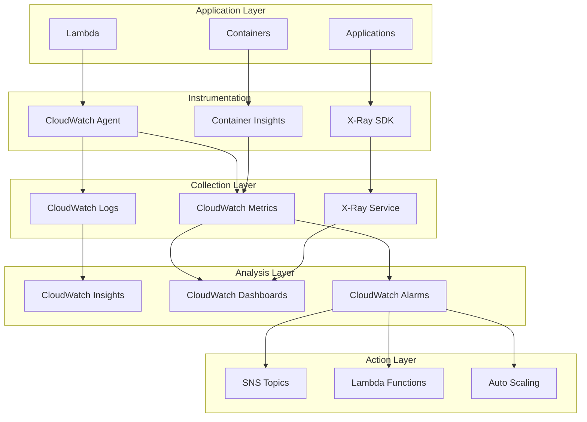
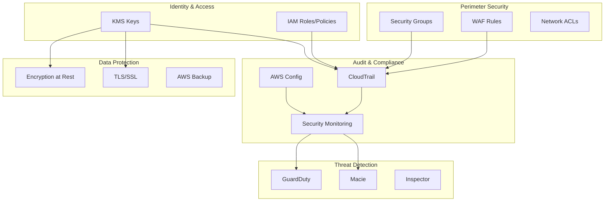
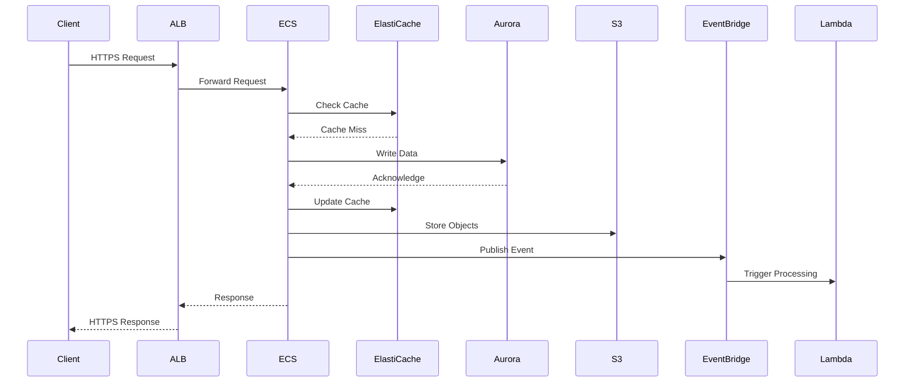
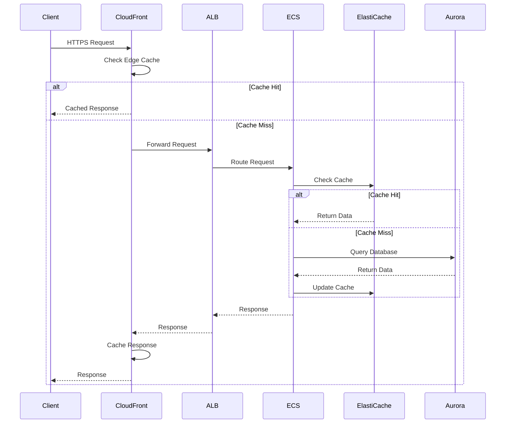
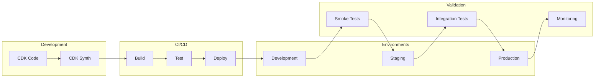
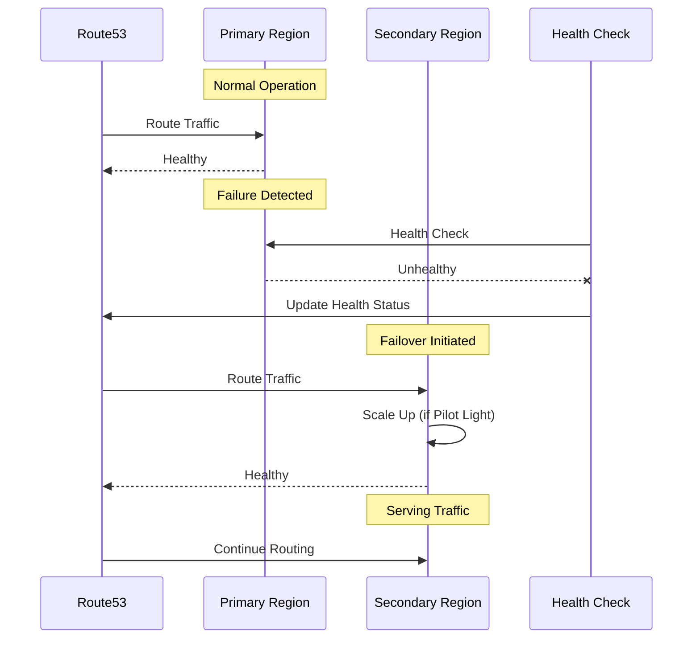
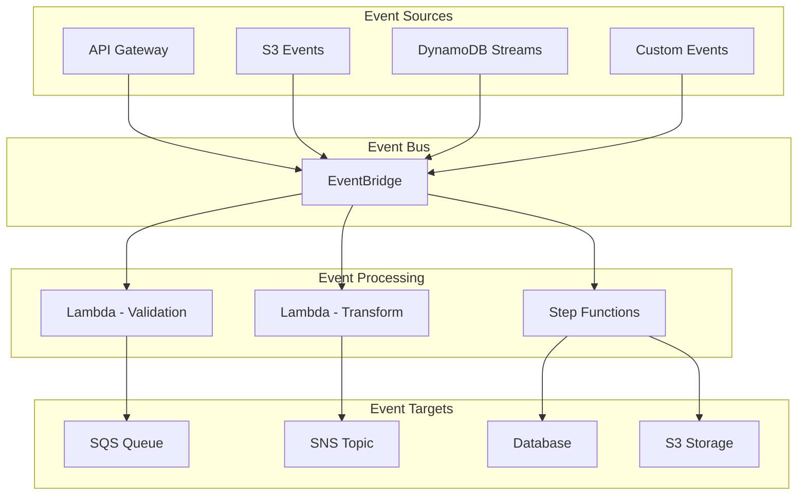

# Component Interaction Diagrams

## Network Flow Diagram

```mermaid
graph TB
    subgraph "Internet"
        User[End User]
    end

    subgraph "Edge Layer"
        R53[Route53]
        CF[CloudFront]
        WAF[WAF]
    end

    subgraph "Load Balancing"
        ALB[Application Load Balancer]
        APIGW[API Gateway]
    end

    subgraph "Compute Layer"
        ECS[ECS Cluster]
        EKS[EKS Cluster]
        Lambda[Lambda Functions]
        ASG[Auto Scaling Group]
    end

    subgraph "Integration Layer"
        EB[EventBridge]
        SF[Step Functions]
        AM[App Mesh]
    end

    subgraph "Data Layer"
        Aurora[Aurora Global]
        RDS[RDS]
        DDB[DynamoDB]
        EC[ElastiCache]
    end

    subgraph "Storage Layer"
        S3[S3 Buckets]
    end

    User --> R53
    R53 --> CF
    CF --> WAF
    WAF --> ALB
    WAF --> APIGW
    ALB --> ECS
    ALB --> EKS
    ALB --> ASG
    APIGW --> Lambda
    Lambda --> EB
    Lambda --> SF
    ECS --> AM
    EKS --> AM
    AM --> Aurora
    AM --> DDB
    Lambda --> Aurora
    Lambda --> DDB
    ECS --> R
_Aurora[Aurora Active]
        WS_S3[S3 Active]
        WS_Compute[Compute Scaled Down]
    end

    P_Aurora -->|Replication| DR_Aurora
    P_S3 -->|Cross-Region Replication| DR_S3
    P_Aurora -->|Replication| WS_Aurora
    P_S3 -->|Cross-Region Replication| WS_S3

    P_VPC -.->|Transit Gateway| DR_VPC
    P_VPC -.->|Transit Gateway| WS_VPC
```

## Monitoring & Observability Flow



## Security Architecture Flow



## Data Flow - Write Path



## Data Flow - Read Path



## Deployment Flow



## Multi-Region Failover



## Event-Driven Architecture


